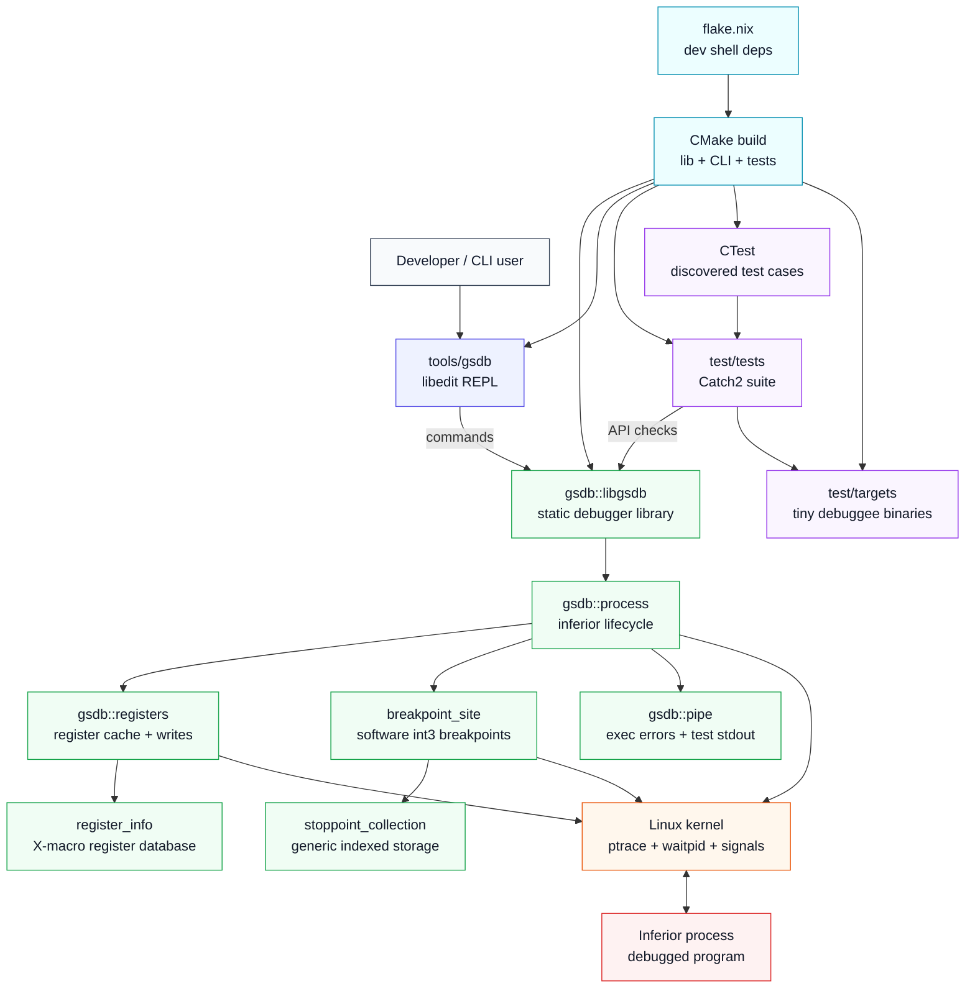
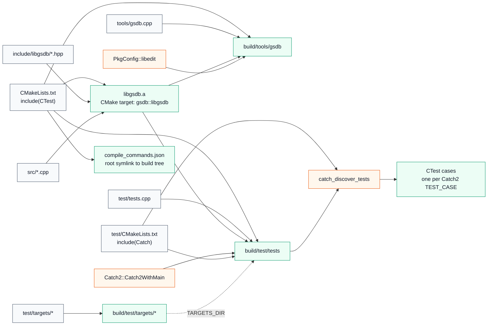
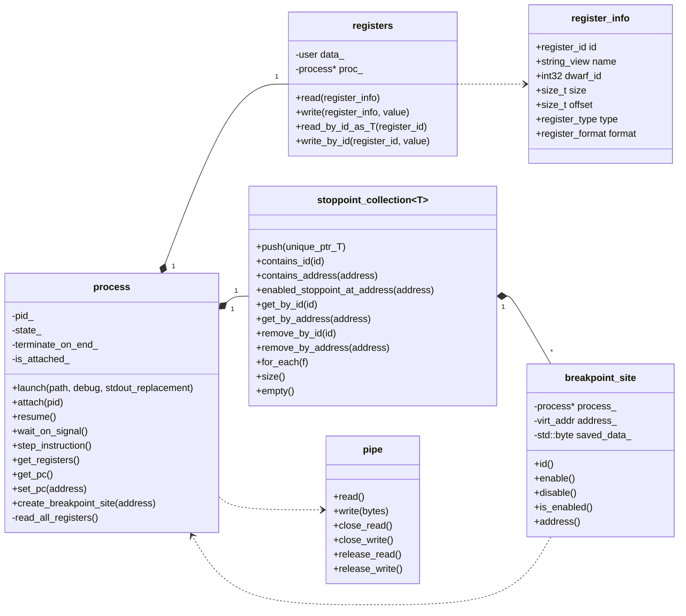
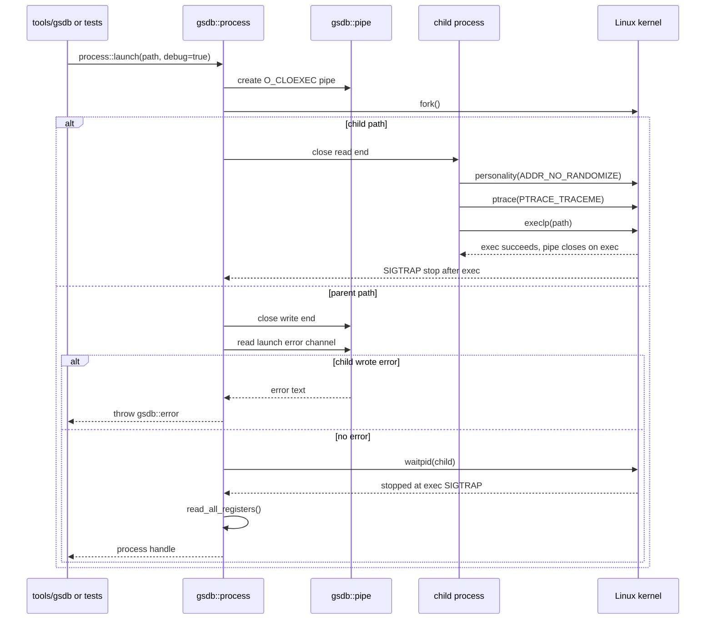
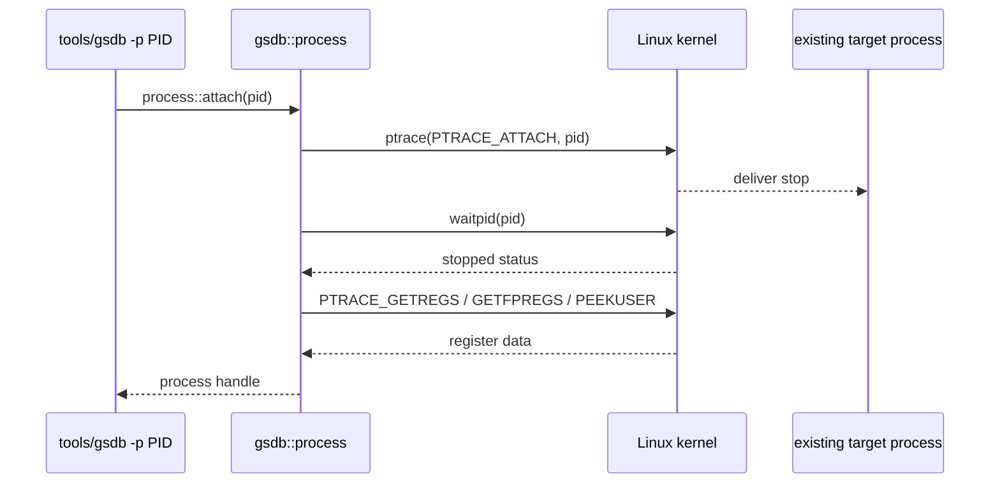
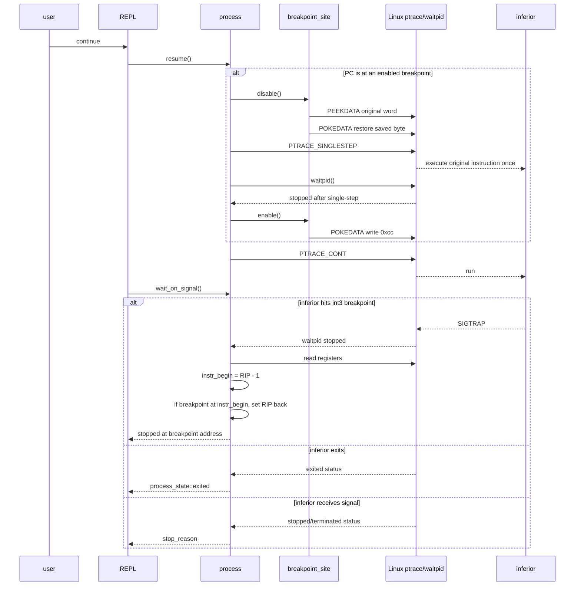
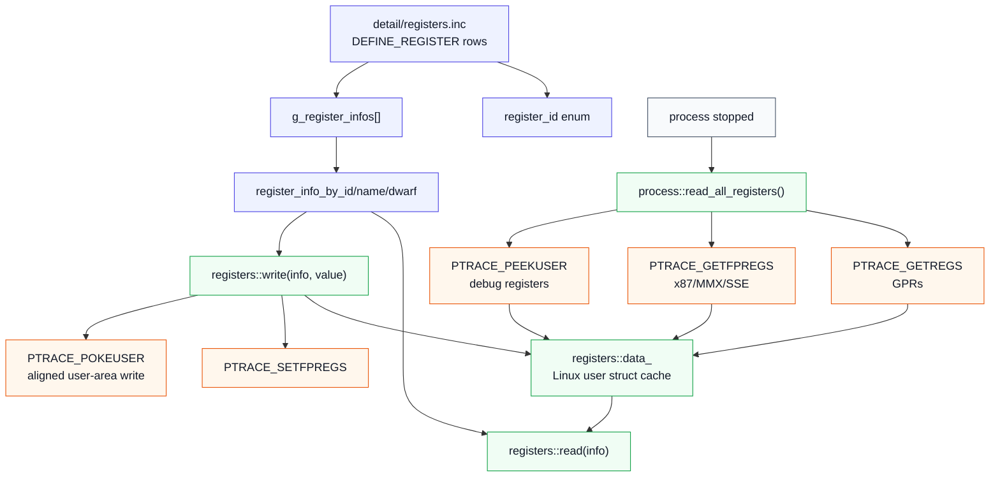
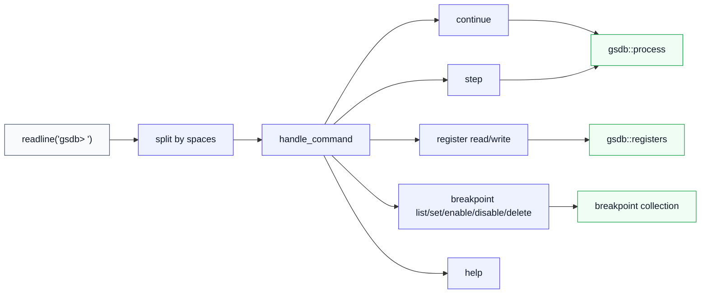
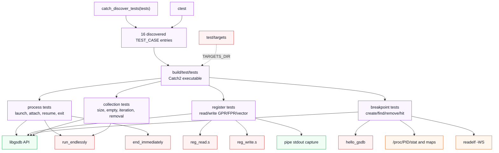
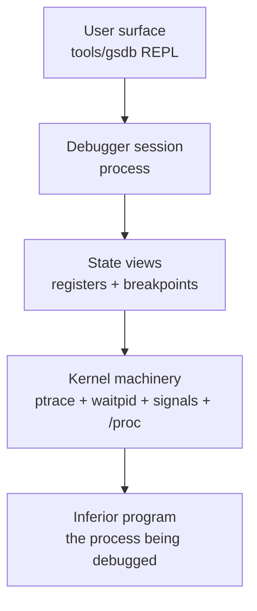

# gsdb Architecture Walkthrough

This document is a guided map of the current `gsdb` project: a Linux debugger
written in C++23 around `ptrace`, aimed at x86-64 ELF programs.

It focuses on how the project is shaped today, what each part owns, and how the
major runtime paths fit together.

## 1. Big Picture



The important separation is:

- `tools/gsdb.cpp` is the user-facing shell.
- `src/` and `include/libgsdb/` are the reusable debugger engine.
- `test/tests.cpp` drives the engine directly, using small binaries in
  `test/targets/` as debuggee processes.
- The kernel is part of the architecture. Most real debugger behavior happens
  through `ptrace`, `waitpid`, process signals, `/proc`, and x86-64 register
  structures.

## 2. Directory Map

```txt
gsdb/
  CMakeLists.txt                root build, CTest, compile_commands symlink
  flake.nix

  include/libgsdb/
    process.hpp                 public process API
    target.hpp                  owns a process plus its loaded elf
    stack.hpp                   stack_frame, inline height, CFI unwind driver
    registers.hpp               register cache and typed access API
    register_info.hpp           register metadata lookup helpers
    detail/registers.inc        X-macro register table
    detail/dwarf.h              raw DW_* constant enums
    breakpoint.hpp              address/function/line breakpoint objects
    breakpoint_site.hpp         one software or hardware breakpoint site
    watchpoint.hpp              hardware watchpoint
    stoppoint_collection.hpp    generic container for breakpoints/watchpoints
    disassembler.hpp            Zydis wrapper
    elf.hpp                     mmap'd ELF parser and symbol tables
    dwarf.hpp                   DWARF parser, line table, CFI
    syscalls.hpp                syscall name/id mapping
    pipe.hpp                    small RAII pipe wrapper
    parse.hpp                   CLI value parsing helpers
    bit.hpp                     byte conversion helpers
    types.hpp                   virt_addr, file_addr, file_offset, span,
                                byte64, byte128, stoppoint_mode
    error.hpp                   exception type

  src/
    process.cpp                 ptrace lifecycle, wait, resume, attach, launch
    target.cpp                  process+elf coordinator, source-level stepping
    stack.cpp                   inline stack, frame list, unwind
    registers.cpp               read/write logic for GPR/FPR/debug registers
    breakpoint.cpp              breakpoint resolution to sites
    breakpoint_site.cpp         patch/unpatch int3 breakpoint bytes
    watchpoint.cpp              hardware watchpoint slots and value tracking
    disassembler.cpp            Zydis decode from inferior memory
    elf.cpp                     ELF header/section/symbol parsing
    dwarf.cpp                   DIEs, abbrevs, line table, ranges, CFI
    types.cpp                   address-type conversions
    syscalls.cpp                syscall table lookups
    pipe.cpp                    pipe2/read/write/close wrapper
    include/syscalls.inc        private X-macro syscall table

  tools/
    gsdb.cpp                    libedit REPL and command dispatch

  test/
    CMakeLists.txt              Catch2 executable and CTest discovery
    tests.cpp                   Catch2 tests for process/register/breakpoint/
                                memory/watchpoint/syscall/elf/dwarf/target
    targets/
      CMakeLists.txt            debuggee target builders
      *.cpp, *.s                small tracee binaries
```

> **Scope note.** Sections 4–11 below describe the `process`-centred core as it
> stood before the ELF, DWARF, `target`, and `stack` layers landed. They are
> still accurate about that core, but `process` is no longer the whole spine —
> `target` now owns a `process` plus its `elf`, and drives source-level stepping.
> See `.codex/elf-support-walkthrough.md` and
> `.codex/dwarf-line-table-walkthrough.md` for those layers.

## 3. Build and Link Shape



The library is the center of the project. The CLI and tests both link against
`gsdb::libgsdb`, but the CLI also links `libedit`, and the tests link Catch2.
The root build includes CTest and gates the test subdirectory with
`BUILD_TESTING`; `test/CMakeLists.txt` includes Catch2's CMake helper and calls
`catch_discover_tests(tests)`, so `ctest` sees each Catch2 `TEST_CASE` as its own
test. The root CMake file also exports `compile_commands.json` and creates a
project-root symlink for clangd when one is not already present.

## 4. Runtime Object Model



The most important ownership rule is that `process` owns the live debugging
session. It owns the register cache and the breakpoint collection. Breakpoints
store a back pointer to the owning process so they can call `ptrace` against the
right PID when enabling or disabling themselves.

## 5. Launch Flow



The launch path uses a pipe for clean error reporting across `fork` and `exec`.
If `ptrace` or `exec` fails in the child, the child writes a text error into the
pipe before exiting. If `exec` succeeds, `O_CLOEXEC` closes the pipe
automatically and the parent sees no error data.

## 6. Attach Flow



Attached processes are detached when the `process` object is destroyed, while
launched debuggee processes are killed on destruction. That distinction lives in
the `terminate_on_end_` and `is_attached_` flags.

## 7. Continue and Breakpoint Flow



Software breakpoints are implemented by replacing the first byte at an address
with `0xcc`, the x86-64 `int3` instruction. When the CPU executes `int3`, `rip`
has already advanced by one byte, so `wait_on_signal()` rewinds `rip` back to
the breakpoint address when it recognizes one of its own breakpoint sites.

## 8. Register Subsystem



The register table is one of the main structural wins in the project. The
X-macro file is included once to build the `register_id` enum and again to build
the metadata array. Every register entry carries:

- debugger id
- textual name
- DWARF id where applicable
- byte size
- offset inside Linux's `user` struct
- category: GPR, sub-GPR, FPR, debug register
- display/storage format

`registers::data_` is a snapshot, refreshed when the process stops. Reads come
from that cache. Writes update the cache first and then push the relevant bytes
back through `ptrace`.

## 9. CLI Command Layer



The CLI is intentionally thin. It parses simple prefix commands and delegates to
the library:

- `continue` calls `process::resume()` and then `wait_on_signal()`.
- `stepi` calls `process::step_instruction()`; `step`, `next`, and `finish` call
  the source-level `target::step_in()` / `step_over()` / `step_out()`.
- `register read` formats cached register values.
- `register write` parses text and calls `registers::write()`.
- `breakpoint set` creates and enables a `breakpoint_site`.
- breakpoint id commands operate through `stoppoint_collection`.
- `watchpoint`, `memory`, `disassemble`, and `catchpoint` were added after this
  section was written and follow the same thin-dispatch shape.

## 10. Test Architecture



The tests are integration-style tests. They launch real tracee programs and
exercise real `ptrace` behavior. That is appropriate for a debugger, but it also
means the tests need a host where `ptrace` is permitted.

The test binary can still be run directly:

```console
./build/test/tests
```

CTest discovery is now wired through Catch2:

```console
ctest --test-dir build
```

`catch_discover_tests(tests)` registers each Catch2 `TEST_CASE` as a separate
CTest test. `test/tests.cpp` now holds 29 `TEST_CASE`s: process lifecycle,
register read/write, breakpoint hit/lookup/removal and collection behavior, plus
memory, watchpoint, syscall/catchpoint, ELF, DWARF, and target cases.

## 11. Mental Model

The project can be remembered in four layers:



The `process` class is the spine:

1. It owns the debugged PID and lifecycle policy.
2. It waits for stops and translates wait statuses into `stop_reason`.
3. It refreshes the register snapshot whenever the tracee stops.
4. It owns breakpoint sites and coordinates stepping over them.
5. It is the bridge between user-facing commands and kernel-level debugger
   operations.

The rest of the project hangs off that spine:

- `registers` gives typed access to the stopped process state.
- `breakpoint_site` knows how to patch one address.
- `stoppoint_collection` indexes breakpoint-like objects.
- `pipe` handles parent/child communication for launch errors and tests.
- `register_info` describes the architecture-specific register layout.
