# DWARF Line Table Walkthrough

This document explains the current line-table implementation in `gsdb`: what it
parses, how the data model is shaped, how iteration runs the DWARF line-number
program, and where the design has sharp edges.

The implementation is mainly in:

- `include/libgsdb/dwarf.hpp`
- `src/dwarf.cpp`
- `include/libgsdb/detail/dwarf.h`
- `test/tests.cpp`

## Code Map

```text
include/libgsdb/dwarf.hpp
  line_table::file              stored file-table entries
  line_table                    parsed header + lazy line program
  line_table::entry             one emitted matrix row / VM register snapshot
  line_table::iterator          lazy DWARF line-program interpreter
  compile_unit::lines()         access to the compile unit's line table
  dwarf::line_entry_at_address  CU selection + address lookup
  die::location/file/line       DIE declaration/call-site source locations

src/dwarf.cpp
  parse_line_table_file         DWARF file-entry parser + path resolver
  parse_line_table              DWARF v4 line-table header parser
  path_ends_in                  relative path suffix match helper
  line_table::iterator methods  line-program execution
  get_entry_by_address          address-to-row lookup
  get_entries_by_line           source-line-to-row lookup

include/libgsdb/detail/dwarf.h
  DW_LNS_* and DW_LNE_* opcode constants

test/tests.cpp
  "Line table" Catch2 case over the hello_gsdb fixture
```

## 1. Mental Model

A DWARF line table maps machine-code address ranges back to source locations:

```text
address      file            line  column  flags
0x1139       hello.cpp       4     12      is_stmt
0x113d       hello.cpp       4     23      is_stmt
0x114c       hello.cpp       4     41      is_stmt, discriminator=1
0x1151       hello.cpp       4     41      !is_stmt
0x1153       hello.cpp       4     41      end_sequence
```

DWARF does not usually store that table directly. It stores a compact bytecode
program in `.debug_line`. A debugger executes the bytecode with a small state
machine. Each emitted state becomes one row in the logical line table.

In `gsdb`, the line table is lazy:

- the line-table header and file/directory tables are parsed eagerly when a
  compile unit is constructed;
- the row matrix is not materialized;
- `line_table::iterator` replays the line-number program and yields emitted rows
  one at a time.

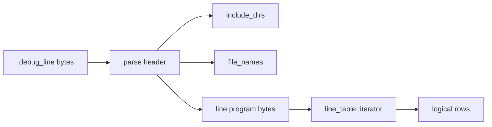

## 2. Object Ownership

Each `gsdb::dwarf` owns compile units. Each `compile_unit` owns one optional
`line_table`.

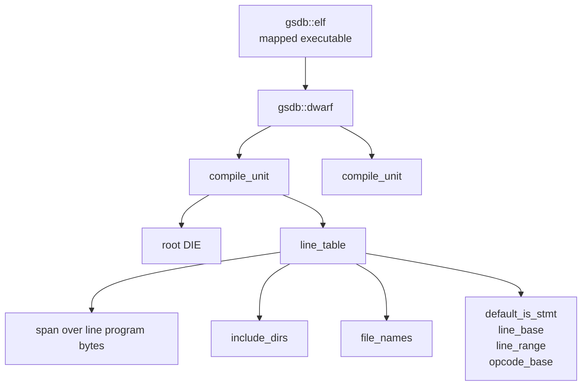

Relevant fields:

```text
line_table
|
+-- data_                span of line program bytes, after the header
+-- cu_                  owning compile unit context
+-- default_is_stmt_     initial state-machine value
+-- line_base_           special-opcode line delta base
+-- line_range_          special-opcode line delta modulus
+-- opcode_base_         first special opcode value
+-- include_dirs_        resolved directory table
+-- file_names_          resolved file table, mutable for DW_LNE_define_file

line_table::entry
|
+-- address              file_addr
+-- file_index           1-based file table index
+-- line
+-- column
+-- is_stmt
+-- basic_block_start
+-- end_sequence
+-- prologue_end
+-- epilogue_begin
+-- discriminator
+-- file_entry           pointer to file_names_[file_index - 1]
```

The implementation uses `file_addr`, not `virt_addr`, inside line-table rows.
Runtime addresses need to be converted through ELF load-bias logic before
line-table lookup.

## 3. Construction Flow

Line-table parsing is triggered while compile units are being parsed.

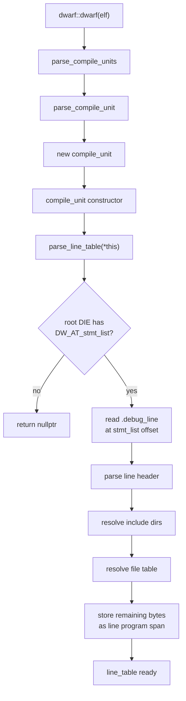

The key path is:

```text
dwarf::dwarf
  -> parse_compile_units
  -> parse_compile_unit
  -> compile_unit::compile_unit
  -> parse_line_table
```

`parse_line_table()` reads `.debug_line`, using the compile unit root DIE's
`DW_AT_stmt_list` as the section offset.

## 4. Header Parsing

`parse_line_table()` supports DWARF v4 line tables with the assumptions already
used elsewhere in the project:

- DWARF32 length format;
- version `4`;
- minimum instruction length `1`;
- maximum operations per instruction `1`;
- standard opcode lengths matching the DWARF v4 defaults for opcodes 1-12.

The parser reads:

```text
unit_length
version
header_length
minimum_instruction_length
maximum_operations_per_instruction
default_is_stmt
line_base
line_range
opcode_base
standard_opcode_lengths
include_directories
file_names
line_program
```

The line-program span begins immediately after the terminating null byte of the
file-name table.

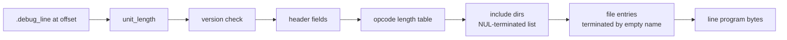

## 5. Directory And File Resolution

DWARF file entries contain:

```text
file name string
directory index
modification time
file length
```

`parse_line_table_file()` resolves each file to a path:

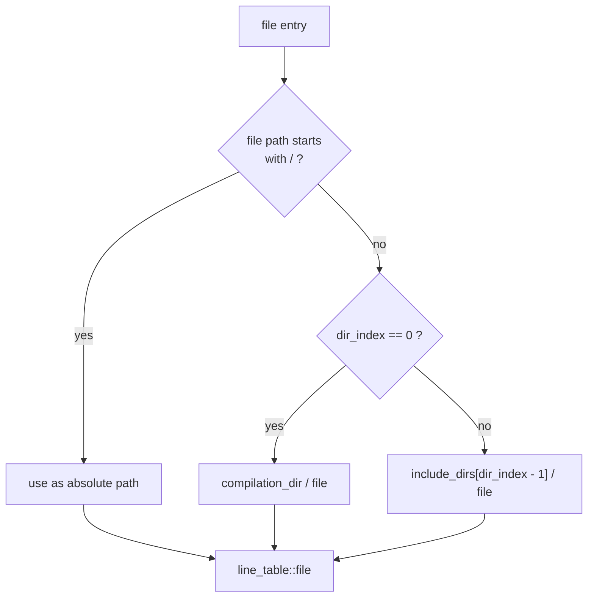

For relative lookup later, `get_entries_by_line()` accepts a relative path and
matches it as a suffix of the stored absolute path. That is handled by
`path_ends_in(lhs, rhs)`, which compares path components lexically:

```text
lhs = /repo/test/targets/hello_gsdb.cpp
rhs = targets/hello_gsdb.cpp

compare trailing components:
targets == targets
hello_gsdb.cpp == hello_gsdb.cpp
```

It does not inspect file contents. It also does not only compare the final
filename unless `rhs` itself contains only a filename.

## 6. Iterator Design

`line_table::begin()` constructs a `line_table::iterator`. The iterator stores:

```text
table_       pointer back to the line_table
current_     most recently emitted row
registers_   current DWARF line-state machine registers
pos_         current byte position in the line program
```

The iterator constructor initializes `registers_.is_stmt` from
`default_is_stmt_`, then immediately increments itself so `begin()` points at the
first emitted row.

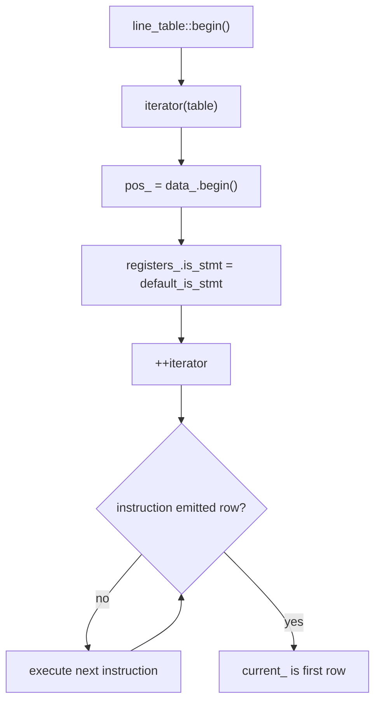

`line_table::end()` returns a default/value-initialized iterator. Equality is
only `pos_ == rhs.pos_`, so the end sentinel is represented by `pos_ == nullptr`.

## 7. Line Program Execution

`operator++()` repeatedly calls `execute_instruction()` until an instruction
emits a row.

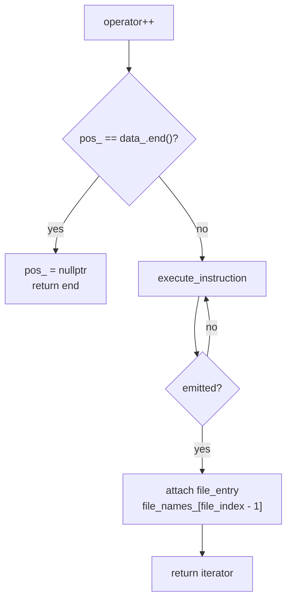

The DWARF line program has three instruction classes.

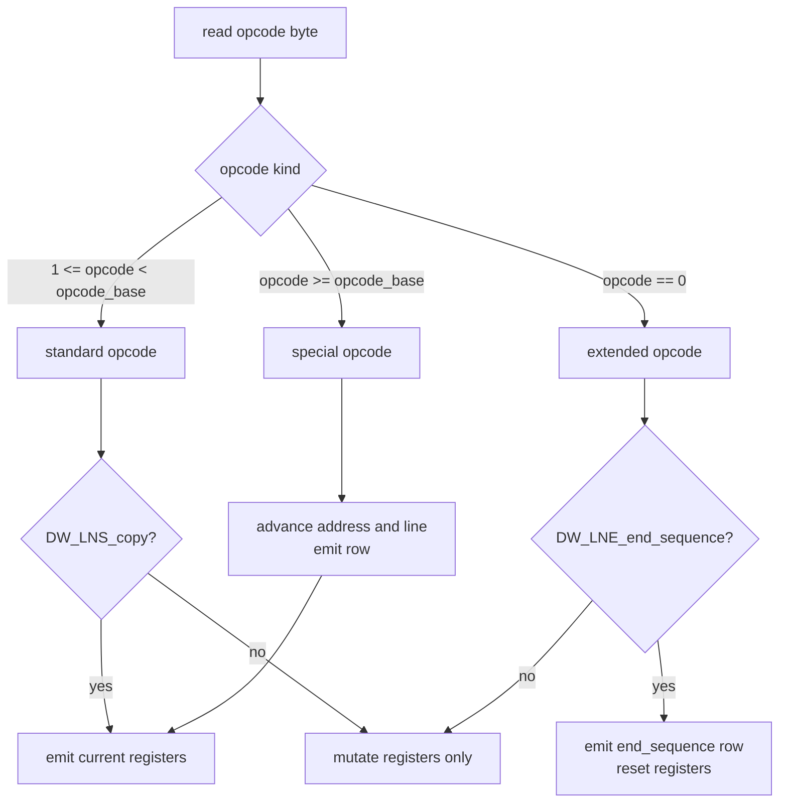

### Standard Opcodes

Supported standard opcodes:

| Opcode | Effect |
| --- | --- |
| `DW_LNS_copy` | Emits the current registers as a row. |
| `DW_LNS_advance_pc` | Adds a ULEB128 delta to `address`. |
| `DW_LNS_advance_line` | Adds an SLEB128 delta to `line`. |
| `DW_LNS_set_file` | Sets the 1-based file index. |
| `DW_LNS_set_column` | Sets the source column. |
| `DW_LNS_negate_stmt` | Toggles `is_stmt`. |
| `DW_LNS_set_basic_block` | Marks the next row as a basic-block start. |
| `DW_LNS_const_add_pc` | Adds the fixed DWARF const-add address delta. |
| `DW_LNS_fixed_advance_pc` | Adds a 16-bit address delta. |
| `DW_LNS_set_prologue_end` | Marks the next row as a prologue end. |
| `DW_LNS_set_epilogue_begin` | Marks the next row as an epilogue begin. |
| `DW_LNS_set_isa` | Currently ignored. |

After an emitted normal row, these per-row flags are cleared:

- `basic_block_start`
- `prologue_end`
- `epilogue_begin`
- `discriminator`

### Extended Opcodes

Extended opcodes start with byte `0`, followed by a ULEB128 payload length and an
extended opcode byte.

| Opcode | Effect |
| --- | --- |
| `DW_LNE_end_sequence` | Emits a row with `end_sequence = true`, then resets the registers. |
| `DW_LNE_set_address` | Reads a 64-bit address and stores it as `file_addr`. |
| `DW_LNE_define_file` | Parses and appends a new file entry to `file_names_`. |
| `DW_LNE_set_discriminator` | Sets the discriminator for the next emitted row. |

### Special Opcodes

Special opcodes combine address and line movement into one byte and then emit a
row:

```text
adjusted_opcode = opcode - opcode_base
address += adjusted_opcode / line_range
line += line_base + (adjusted_opcode % line_range)
emit row
```

Because the parser requires minimum instruction length and maximum operations
per instruction to both be `1`, the current formula can stay simple.

## 8. Address-To-Line Lookup

`line_table::get_entry_by_address(file_addr address)` scans the emitted rows and
returns the row whose address range contains the requested address.

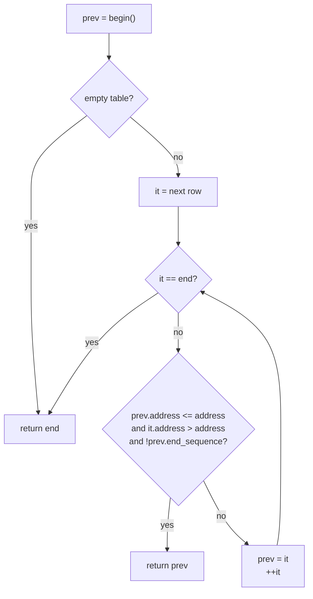

Conceptually:

```text
row N describes addresses [row N address, row N+1 address)
```

An `end_sequence` row terminates a contiguous address sequence and is not a
source row for lookup.

`dwarf::line_entry_at_address(file_addr)` first finds the compile unit whose
root DIE contains the address, then delegates to that compile unit's line table:

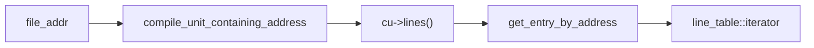

## 9. Line-To-Address Lookup

`line_table::get_entries_by_line(path, line)` scans every emitted row and keeps
rows whose `line` matches and whose file path matches.

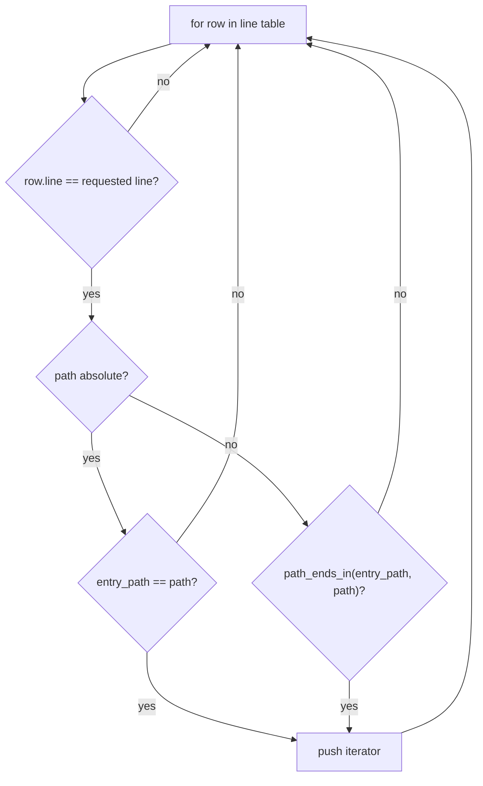

This can return multiple rows for one source line. That is expected: one source
line may compile to several address ranges, especially when a statement contains
multiple operations or inline calls.

## 10. DIE Source Locations

`die::location()` is related to line tables but is not the same as address-row
lookup.

```text
die::location()
  -> die::file()
  -> die::line()
```

For non-inlined DIEs:

- file index comes from `DW_AT_decl_file`;
- line comes from `DW_AT_decl_line`.

For `DW_TAG_inlined_subroutine` DIEs:

- file index comes from `DW_AT_call_file`;
- line comes from `DW_AT_call_line`.

The file index is a 1-based index into `cu->lines().file_names()`.

## 11. Test Coverage Today

The line-table test builds `test/targets/hello_gsdb.cpp` with debug info and
checks direct line-table iteration.

Current source fixture:

```cpp
// 0x555555555147
#include <cstdio>

int main() { std::puts("Hello, gsdb!"); }
```

Current expected decoded line table in `test/tests.cpp`:

```text
hello_gsdb.cpp  4  0x1139
hello_gsdb.cpp  4  0x113d
hello_gsdb.cpp  4  0x114c
hello_gsdb.cpp  4  0x1151
hello_gsdb.cpp  -  0x1153
```

The test checks:

- one compile unit exists;
- the first row is line `4`;
- the first row's filename is `hello_gsdb.cpp`;
- subsequent normal rows are also line `4`;
- then an `end_sequence` row appears;
- one more increment reaches `end()`.

This test validates the iterator over the current compiler output. It is not a
portable semantic guarantee that a particular source line will always emit the
same number of rows.

## 12. Example Execution

For the current `hello_gsdb` target, `readelf --debug-dump=rawline` shows a
program shaped like this:

```text
set column 12
set address 0x1139
special opcode -> address 0x1139, line 4, emit
set column 23
special opcode -> address 0x113d, line 4, emit
set column 41
set discriminator 1
special opcode -> address 0x114c, line 4, emit
negate/set is_stmt false
special opcode -> address 0x1151, line 4, emit
advance pc to 0x1153
end_sequence -> emit terminating row
```

Timeline:

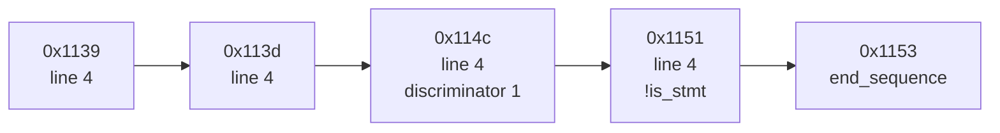

## 13. Design Strengths

- The parser keeps the line-table matrix lazy, so it avoids storing every row.
- Paths are normalized to absolute paths when file entries are parsed.
- Relative path lookup is practical for user-facing commands such as
  `hello_gsdb.cpp:4` or `targets/hello_gsdb.cpp:4`.
- Address rows use `file_addr`, which keeps ELF ownership attached to the
  address and avoids confusing runtime virtual addresses with file addresses.
- The iterator API makes line-table scans simple for address and source-line
  lookup helpers.

## 14. Sharp Edges And Risks

These are implementation details worth keeping in mind before extending source
breakpoints or stepping.

### `die::contains()` Used Assignment Instead Of Comparison (fixed)

The predicate in `die::contains()` used assignment:

```cpp
return spec.attr = attribute;
```

Because the lambda received `spec` by value, this did not mutate the stored
abbreviation table, but it meant `contains(nonzero_attribute)` returned true for
the first attribute in any non-empty DIE — affecting line-table setup,
compile-unit address checks, and function indexing.

It now compares (`src/dwarf.cpp:954`):

```cpp
bool gsdb::die::contains(std::uint64_t attribute) const {
    auto& specs = abbrev_->attr_specs;
    return std::find_if(std::begin(specs), std::end(specs), [=](auto spec) {
               return spec.attr == attribute;
           }) != std::end(specs);
}
```

### `DW_LNS_set_isa` Does Not Consume Its Operand

The standard opcode length table says `DW_LNS_set_isa` has one operand. The
switch currently just `break`s. If a compiler emits this opcode, the cursor will
not advance past its ULEB128 operand and the rest of the line program will be
decoded incorrectly.

### Dynamic File Entries Can Mutate During Iteration

`DW_LNE_define_file` appends to `line_table::file_names_` during iteration. That
is why `file_names_` is `mutable`.

Consequences:

- repeated full iterations could append the same dynamically-defined files more
  than once;
- appending can reallocate the vector and invalidate `file_entry` pointers held
  by already-returned iterators.

This is probably harmless for current test binaries, but it matters if source
breakpoint code stores iterators long-term.

### `get_entries_by_line()` Includes End-Sequence Rows

The line-to-address scan filters by line and path, but not by
`!it->end_sequence`. An end-sequence row can retain the previous line/file state,
so a source-line lookup may include a terminating marker as if it were a real
address row.

For breakpoint placement, those rows should likely be excluded.

### Exact Row Counts Are Compiler-Sensitive

Line tables are compiler output. The current `hello_gsdb.cpp` line table emits
several rows for line 4 and no row for the blank line 3. Another compiler or
version may emit different rows while still being correct DWARF.

Tests that assert an exact row sequence are useful parser smoke tests, but they
can be brittle across toolchains.

### `line_table_` Can Be Null

`parse_line_table()` returns `nullptr` when a compile unit has no
`DW_AT_stmt_list`. `compile_unit::lines()` dereferences `line_table_` without a
guard. Current usage assumes debug line info exists.

### Header Support Is Narrow By Design

The implementation intentionally accepts only a narrow DWARF v4 shape:

- no DWARF64 line-table lengths;
- no DWARF v5 line-table layout;
- 64-bit addresses for `DW_LNE_set_address`;
- minimum instruction length `1`;
- maximum operations per instruction `1`;
- expected standard opcode lengths fixed to the v4 default table.

That is fine for the current test targets, but it is not a general-purpose
DWARF line parser yet.

## 15. Practical Extension Points

For source breakpoints:

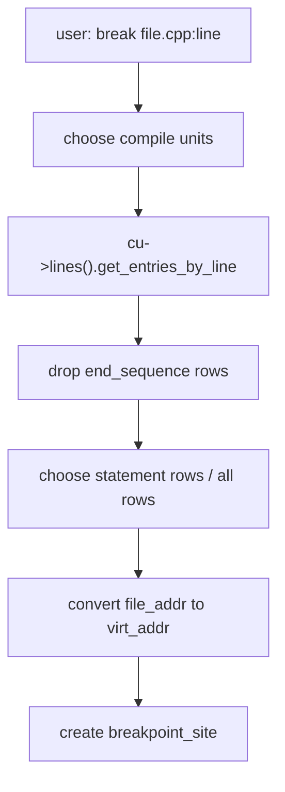

For source-level stepping:

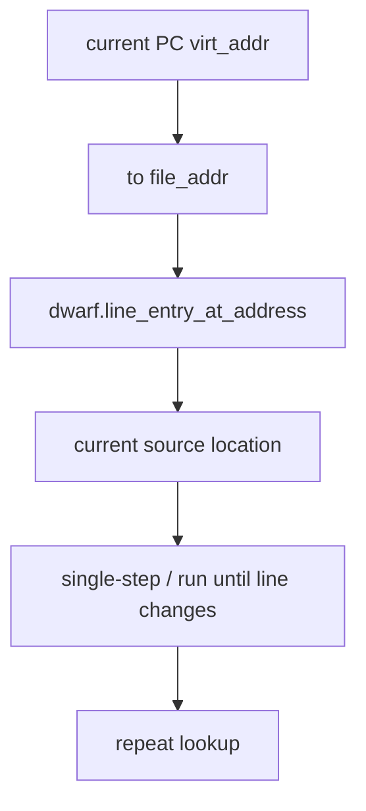

Before building on this heavily, the likely cleanup order is:

1. ~~Fix `die::contains()`.~~ Done — see above.
2. Make `DW_LNS_set_isa` consume its operand (`src/dwarf.cpp:1415` still just
   `break`s).
3. Filter `end_sequence` in source-line lookup.
4. Decide whether `line_table` should materialize rows or keep lazy iteration.
5. If keeping lazy iteration, avoid long-lived `file_entry` pointers that can be
   invalidated by `DW_LNE_define_file`.
6. Make tests assert semantic properties, with one narrowly-scoped fixture test
   for exact opcode/row behavior if needed.
