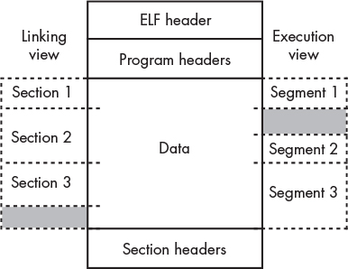
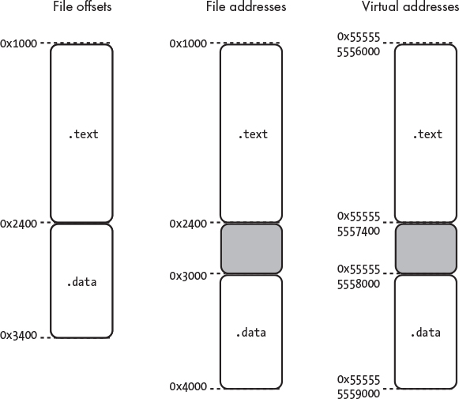

# gsdb

A debugger for Linux, written from scratch in C++.

## Run

To test registers:

```console
./build/tools/gsdb ./build/test/targets/reg_read
```

To test watchpoints:

```console
./build/tools/gsdb ./build/test/targets/anti_debugger
# then, inside gsdb>
# find the address by using objdump -d ./build/test/targets/anti_debugger| grep an_innocent_function
gsdb> watch set 0x555555555169 rw 1
```

## Project Structure

### The linking flow in summary

```txt
include/libgsdb/libgsdb.hpp  (public header)
      ↓ PUBLIC include path
 src/libgsdb.cpp → [libgsdb.a]
      ↓                    ↓
 gsdb::libgsdb        gsdb::libgsdb
 + PkgConfig::libedit + Catch2::Catch2WithMain
      ↓                    ↓
 tools/gsdb            test/tests
 (CLI binary)          (test binary)
```

## Notes

On Linux systems, executable programs are encoded as **Executable and Linkable Format (ELF)** files.

The debug information format used on Linux systems is **DWARF**.

We usually don’t want to allow the execution of memory that is on the stack, as this can lead to security vulnerabilities.

The main debug syscall provided by Linux and macOS to carry out these low-level jobs is `ptrace`.

**Interrupt handlers** are kind of like signal handlers, but they’re set up in special regions of memory and interact directly with the hardware.

The register used to keep track of the current instruction is called the **program counter** or **instruction pointer**.

C++ exceptions don’t flow between processes.

Pipes are a form of buffered communication, able to retain up to 64KiB of data by default before being read from.

### Linux **process filesystem (procfs)**

Enables us to examine the processes running on a system through files.

A virtual filesystem located at `/proc`.

- `/proc/<pid>/stat` - gives high-level information about the state of a given process, such as:
  - the name of the executable the process is running
  - the PID of its parent
  - the amount of time for which it has been running
  - the current process execution state.

### Registers

#### Sets of Registers

- general purpose
  - 16 64-bit
- x87 - `long double` support
  - x87 instructions operate on a stack of values within `st0` - `st7` registers
  - **FPU (floating-point unit)** stack
  - `fld` & `fstp` for pushing/popping values from top
  - `faddp` - arithmetic operations
    - pops top two values from FPU stack,
    - adds them,
    - pushes the result
- MMX
  - SIMD (single instruction multiple data)
- SSE
  - **Streaming SIMD Extensions**
- SSE2
- AVX (Advanced Vector Extensions)
- AVX-512
- debug

Linux uses **System V ABI (SYSV ABI)**.

- `rax` Caller-saved general register; used for return values
- `rbx` Callee-saved general register
- `rcx` Used to pass the fourth argument to functions
- `rdx` Used to pass the third argument to functions
- `rsp` Stack pointer
- `rbp` Callee-saved general register; optionally used pointer to the top of the stack frame
- `rsi` Used to pass the second argument to functions
- `rdi` Used to pass the first argument to functions
- `r8` Used to pass the fifth argument to functions
- `r9` Used to pass the sixth argument to functions
- `r10`–`r11` Caller-saved general registers
- `r12`–`r15` Callee-saved general registers

Caller-saved registers can be safely written over inside a function without causing chaos. Callee-saved registers must be saved at the start of the function and restored at the end of the function if they’re to be modified. (How do I remember this though)

x64 has segment registers named `es`, `cs`, `ss`, `ds`, `fs`, and `gs`.
Compilers still use the fs and gs registers to support thread-local variables, variables that each thread of a process has its own copy of.

Two other 64-bit registers to be aware of are:

- `rip`, which stores the instruction pointer (or program counter), and
- `rflags`, which tracks various pieces of information about the state of the processor.

Today, compilers use **Streaming SIMD Extensions (SSE)** instructions instead of the **x87** instructions and registers for general floating-point operations, but x87 registers are still used for long double support because they enable higher precision than SSE.

SYSV ABI says that `long double` arguments must be passed on the function’s stack frame rather than using registers, and you can’t just use `mov` to transfer a value out of an `st` register.

#### How to Interact with Registers with `ptrace`

- `PTRACE_GETREGS` & `PTRACE_SETREGS`
  - read/write _all_ general-purpose registers at once
- `PTRACE_GETFPREGS` & `PTRACE_SETFPREGS`
  - read/write x87, MMX, and SSE registers
- `PTRACE_PEEKUSER` - read debug regisers
- `PTRACE_POKEUSER`
  - write debug registers, or
  - write single general-purpose register

#### DWARF

Each CPU architecture numbers its registers differently.

DWARF defines its own standardized numbering scheme for registers, independent of the
hardware's native encoding.

For example, on x86-64, DWARF register `0` is `rax`, register `7` is `rsp`, register `16` is `rip`, etc.

The debugger needs a mapping from DWARF register numbers to the actual register values it reads via `ptrace`.

### X-Macros

**X-Macros** allow us to maintain independent data structures whose members or operations rely on the same underlying data and must be kept in sync.

a.k.a. **include-file macro**

### Assembly

GCC defaults to AT&T syntax.

```assembly
# move 64 bits of data from rsp to rbp
movq %rsp, %rbp
```

#### How to issue syscalls in assembly

- System V ABI:
  - the syscall ID goes in `rax`;
  - subsequent arguments go in `rdi`, `rsi`, `rdx`, `r10`, `r8`, and `r9`;
  - and the return value of the syscall is stored in `rax`

### Breakpoints

#### Hardware vs. Software Breakpoints

Hardware breakpoints involve setting architecture-specific registers to produce breaks for you.

Whereas software breakpoints involve modifying the machine instructions in the process’s memory.

The number of hardware breakpoints is limited by the number of debug registers in the system. On x64, there are only four hardware breakpoint registers.

Hardware breakpoints have the powerful ability to trigger breaks if a given address is executed, written to, or read from. Software breakpoints can trigger breaks on execution only.

Hardware breakpoints also enable the debugging of program exploits that involve overwriting memory with executable code, so they can be useful in security and reverse engineering situations.

We set software breakpoints by modifying the executing code on the fly.

The x64 architecture has an **interrupt vector table** that the operating system can use to register handlers for various events, such as dividing by zero, accessing protected memory, or executing invalid opcodes.

When the processor executes the int3 instruction, it passes control to the breakpoint interrupt handler, which—in the case of Linux—signals the process with a SIGTRAP.

Interrupt vector table — The OS registers handler functions for CPU exceptions
(divide-by-zero, page faults, etc.). Each exception type has a numbered slot in this table.

In short: `int3` → CPU exception → kernel handler → SIGTRAP → ptrace notifies debugger.

To enable a breakpoint site, we need to replace the instruction at the given address with an `int3` instruction, which we encode as `0xcc`.

#### Determine where to set breakpoints

Today, many compilers produce **position-independent executables (PIEs)** _by default_. These executables don’t expect to be loaded at a specific memory address; they can be loaded anywhere and still work.

As such, memory addresses within PIEs aren’t absolute virtual addresses, they’re _offsets_ from the start of the final load address of the binary.

PIEs exist to support **address space layout randomization (ASLR)**, a protection against malicious code that takes advantage of known virtual addresses to attack programs.

To test whether a given executable is PIE: `file <executable>`. Something like `ELF 64-bit LSB pid executable`. or `ELF 64-bit LSB shared object`.

To _globally_ disable ASLR, `echo 0 > /proc/sys/kernel/randomize_va_space`.

The `personality` syscall allows you to change some execution properties for processes, like whether they’re limited to 32-bit addresses or whether ASLR is enabled.

We can find information about where the system loaded programs in memory at `/proc/<pid>/maps`.

```txt
load address of the instruction = load address of the segment + instruction's file address - segment's start file address
```

`readelf -S ./build/test/targets/hello_gsdb`

After setting the breakpoint, if you want to continue - the solution is to set the program counter back by 1 byte if we stop at a breakpoint. Then, to resume the process, we can disable the breakpoint, step over a single instruction, re-enable the breakpoint, and resume.

The binary's **entry point**: the function called at the start of the program.
On Linux, it's called `_start`.

In short: file offset = "where in the .elf file on disk", file
address = "where in the virtual address space the ELF says it
should be mapped."

`file_address` and `address` are both file addresses (virtual addresses from the ELF),
just for different things:

- file_address — the file address of the entry point
  (header.e_entry), passed into get_section_load_bias.
- address — the file address of the start of the section (e.g.
  .text) that contains the entry point, parsed from readelf
  output.

The entry point lives somewhere inside a section. So
file_address - address is how many bytes into that section the
entry point sits.

For a concrete example:

.text section: address (VA) = 0x1060, offset (on disk) =
0x0060
entry point: file_address (VA) = 0x1080

- file_address - address = 0x1080 - 0x1060 = 0x20 (entry point
  is 32 bytes into .text)
- - offset = 0x20 + 0x0060 = 0x0080 (entry point is at byte
    0x80 in the file on disk)

### Memory and Disassembly

`PTRACE_PEEKDATA` & `PTRACE_POKEDATA` work on 64-bits at a time.

`process_vm_readv` & `process_vm_writev` and the `/proc/<pid>/mem` file - both support reading/writing larger chunks.

_HOWEVER_, `process_vm_writev` does _NOT_ support writing to protected areas of memory, like code segments.

### Debug Registers

- `DR0` Breakpoint address #0
- `DR1` Breakpoint address #1
- `DR2` Breakpoint address #2
- `DR3` Breakpoint address #3
- `DR4` Obsolete alias for DR6
- `DR5` Obsolete alias for DR7
- `DR6` Debug status register
- `DR7` Debug control register
- `DR8`–`15` Reserved for processor use

**Local** vs. **global** hardware breakpoints.
On Linux, however, the local and global breakpoints actually do the same thing and work in “local” mode.

We can set only four hardware breakpoints at a time, and we must write the addresses at which to break to the DR0 through DR3 registers.

To set a hardware stop point, we need to do the following:

1. Find a free space among the DR registers for the new stop point by locating one that isn’t yet enabled.
2. Write the desired address to the correct DR register.
3. Encode the stop point mode and size into the form expected by the control register.
4. Clear the enable bit, mode bits, and size bits in the control register corresponding to the chosen DR register.
5. Mask in the new bits.
6. Write the new contents of the control register back to the system.

### Watchpoints

Watchpoints use the same mechanisms as hardware breakpoints but can make a process stop when reading from and writing to an address as well as when executing it.

Watchpoints on x64 must be aligned to their size: 8-byte watchpoints must fall on an 8-byte boudary, 4-byte watchpoints on a 4-byte boundary, and so on.

### Signal Handlers

Pressing ctrl-C sends a `SIGINT` signal to the currently executing process.
Ideally, the `gsdb` process should send a `SIGSTOP` to the inferior, then continue reading input from the user.

POSIX defines a list of functions deemed **async-signal-safe**, meaning you can safely call them from inside a signal handler. Use `man signal-safety` to find out.

Use `signal` to install signal handlers.
Handler functions:

`SIG_IGN`
: ignore the signal

`SIG_DFL`
: invokes default handler

`void (*sighandler_t)(int)`
: pointer to user-supplied handler

When you press ctrl-C, you don’t merely send a `SIGINT` to the running process; you send it to all processes in the same process group.

_Forked processes run in the same process group as their parent_, so when gsdb gets a `SIGINT`, the inferior gets a `SIGINT`.

A process group is a Linux/POSIX abstraction that bundles one
or more related processes together so the kernel can deliver
signals and job-control operations to all of them at once.

Core concepts

- Every process has a PID (its own ID) and a PGID (the ID of
  the group it belongs to).
- The PGID is just the PID of the process group leader — the
  process that created the group.
- A `fork()`ed child inherits its parent's PGID by default.
- Process groups live inside a larger container called a
  session (which is what `setsid()` creates and is what `/dev/tty`
  and controlling-terminal logic operate on).

```
Session
├── Process group A (PGID = 100)
│ ├── pid 100 ← leader
│ ├── pid 101
│ └── pid 102
└── Process group B (PGID = 200)
├── pid 200 ← leader
└── pid 201
```

In an interactive shell with job control enabled (the default
for bash/zsh at a terminal), every `&` background job gets put
into its own new process group via `setpgid()`.

Potential values of `si_code` on a `SIGTRAP`:

- `SI_KERNEL` Generic trap sent from the kernel
- `TRAP_BRKPT` Software breakpoint
- `TRAP_HWBKPT` Hardware breakpoint
- `TRAP_TRACE` Single step

GCC and Clang provide a handy function for finding the position of the least significant set bit: `__builtin_ctz`, short for “count trailing zeros.”

### Catchpoints

A **catchpoint** stops the process when a specific event occurs.

To actually receive traps from syscalls, we use the `PTRACE_SYSCALL` request instead of `PTRACE_CONT` when resuming the process.

If we request a `PTRACE_SYSCALL`, the inferior will halt twice for each syscall: once on entry and once on exit.

OS provides a header file `asm/unistd_64.h` that contains syscall macros. Use command

```
$ sed -n -r 's/^#define __NR_(.+) (.+)/DEFINE_SYSCALL(\1,\2)/p' \
/usr/include/x86_64-linux-gnu/asm/unistd_64.h
```

to convert:

```
#define __NR_read 0
#define __NR_write 1
#define __NR_open 2
#define __NR_close 3
```

into:

```cpp
DEFINE_SYSCALL(read,0)
DEFINE_SYSCALL(write,1)
DEFINE_SYSCALL(open,2)
DEFINE_SYSCALL(close,3)
```

### Signal and Interrupt Interals

Linux kernel defines `ptrace` as a syscall at `linux/kernel/ptrace.c`.

### ELF

ELF files can be executable programs, shared libraries, static libraries (called **relocatable files** in the specifications), and core dumps (snapshots of memory and registers taken to debug a process that has crashed).

#### Sections and Segments

ELF communicates **link-time** information in **sections**, named regions of the binary accompanied by relevant flags and attributes.

ELF files communicate **execution-time** information in **segments**.

Results of `readelf --sections --segments test/targets/anti_debugger` contains:

- **section header**: sections
- **program header**: segments
- mapping between sections and segments


_Figure 1: ELF binary layout._

**String tables** hold textual data.

**Symbol tables** describe entities like functions and variables.

`elf.h` header in Linux. The header file also defines the `Elf64_Ehdr` type for 64-bit ELF headers.

ELF files can be megabytes or even gigabytes in size.

One convenient way to handle large files is to use the `mmap` syscall to map them into the virtual memory of our process, letting us pretend we’ve read the file completely into memory.

#### String Tables

A **string table** is a list of null-terminated strings.

It allows the rest of the ELF file to refer to a string using a byte offset into the string table.

ELF file has two string tables: the general string table, which lives in the `.strtab` section, and the section name string table, which lives in the `.shstrtab` section.

The more robust way to handle string tables is to read the `sh_link` field of the section header to which the string table index belongs, which provides the section index of the string table for that section.

To convert between file addresses and virtual addresses, we need to know where the ELF file is loaded in virtual memory.

We must consider three different kinds of addresses

- absolute offsets from the start of the object file (corresponding to the `gsdb::file_offset` type)
- virtual addresses specified in the ELF file (corresponding to the `gsdb::file_addr` type)
- the actual virtual addresses in the executing program (corresponding to the `gsdb::virt_addr` type).

Contiguous sections in the ELF file don’t necessarily map contiguously into memory; gaps could exist between them.

Linux assigns memory permissions to pages of memory, which are 4,096 bytes in size on x64, so if sections with different permissions aren’t aligned to 4,096 bytes, the system must load them with gaps between them.

The file addresses and the real virtual addresses will only ever differ by a single offset for the entire ELF file, called the **load bias**.


_Figure 2: Possible layouts of ELF sections in memory_

#### Symbol Table

A symbol table contains linking-related information about global program entities such as variables and functions.

- The size of the entity (for example, the object size or number of bytes in a function’s machine code)
- Whether the entity is available to other ELF files that might link against it
- The category to which this entity belongs (for example, function, variable, ELF section, or file)

An ELF file may have two symbol tables:

- a complete symbol table named `.symtab` with `SHT_SYMTAB` as the section header’s `sh_type` member, and
- an _abbreviated_ symbol table named `.dynsym` with `SHT_DYNSYM` as the section type, which contains only the set of symbols needed for dynamic linking.

Each ELF file may have at most one of each and _might NOT_ have a symbol table at all.

##### Auxiliary Vectors

To find the code’s load address when constructing the `gsdb::elf` object, we could parse `/proc/<pid>/maps`.

The **auxiliary vector** is an array of identifier/value pairs that the operating system kernel uses to provide information about a process to user space.

It can encode information such as where the ELF program headers were loaded, the PID of the process, and, most importantly for us, the real entry point of the program.

When the process is started, the auxiliary vector is put in memory just above the program stack.

Linux provides the same data in the `/proc/<pid>/auxv` file.
