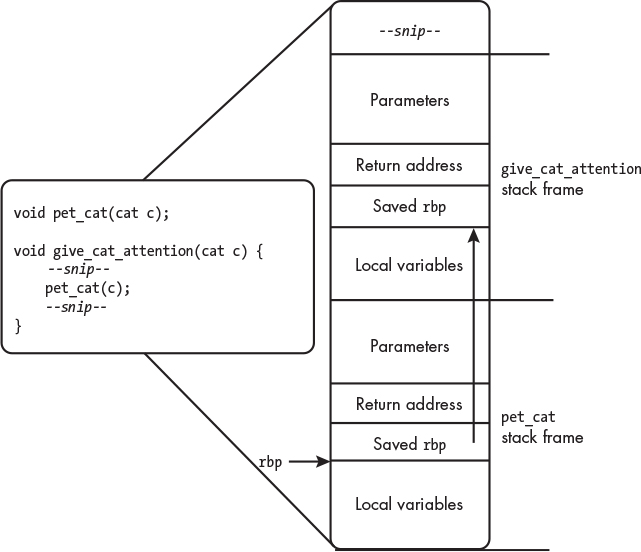

# gsdb

A debugger for Linux, written from scratch in C++.

## Run

To test registers:

```console
./build/tools/gsdb ./build/test/targets/reg_read
```

To test watchpoints:

```console
./build/tools/gsdb ./build/test/targets/anti_debugger
# then, inside gsdb>
# find the address by using objdump -d ./build/test/targets/anti_debugger| grep an_innocent_function
gsdb> watch set 0x555555555169 rw 1
```

## Project Structure

### The linking flow in summary

```txt
 include/libgsdb/          (public headers)
 src/                      (library implementation)
      ↓ PUBLIC include path
   [libgsdb.a]  (CMake target: gsdb::libgsdb, links Zydis::Zydis)
      ↓                    ↓
 gsdb::libgsdb        gsdb::libgsdb
 + PkgConfig::libedit + Catch2::Catch2WithMain
      ↓                    ↓
 tools/gsdb            test/tests
 (CLI binary)          (test binary)
```

## Notes

On Linux systems, executable programs are encoded as **Executable and Linkable Format (ELF)** files.

The debug information format used on Linux systems is **DWARF**.

We usually don’t want to allow the execution of memory that is on the stack, as this can lead to security vulnerabilities.

The main debug syscall provided by Linux and macOS to carry out these low-level jobs is `ptrace`.

**Interrupt handlers** are kind of like signal handlers, but they’re set up in special regions of memory and interact directly with the hardware.

The register used to keep track of the current instruction is called the **program counter** or **instruction pointer**.

C++ exceptions don’t flow between processes.

Pipes are a form of buffered communication, able to retain up to 64KiB of data by default before being read from.

### Linux **process filesystem (procfs)**

Enables us to examine the processes running on a system through files.

A virtual filesystem located at `/proc`.

- `/proc/<pid>/stat` - gives high-level information about the state of a given process, such as:
  - the name of the executable the process is running
  - the PID of its parent
  - the amount of time for which it has been running
  - the current process execution state.

### Registers

#### Sets of Registers

- general purpose
  - 16 64-bit
- x87 - `long double` support
  - x87 instructions operate on a stack of values within `st0` - `st7` registers
  - **FPU (floating-point unit)** stack
  - `fld` & `fstp` for pushing/popping values from top
  - `faddp` - arithmetic operations
    - pops top two values from FPU stack,
    - adds them,
    - pushes the result
- MMX
  - SIMD (single instruction multiple data)
- SSE
  - **Streaming SIMD Extensions**
- SSE2
- AVX (Advanced Vector Extensions)
- AVX-512
- debug

Linux uses **System V ABI (SYSV ABI)**.

- `rax` Caller-saved general register; used for return values
- `rbx` Callee-saved general register
- `rcx` Used to pass the fourth argument to functions
- `rdx` Used to pass the third argument to functions
- `rsp` Stack pointer
- `rbp` Callee-saved general register; optionally used pointer to the top of the stack frame
- `rsi` Used to pass the second argument to functions
- `rdi` Used to pass the first argument to functions
- `r8` Used to pass the fifth argument to functions
- `r9` Used to pass the sixth argument to functions
- `r10`–`r11` Caller-saved general registers
- `r12`–`r15` Callee-saved general registers

Caller-saved registers can be safely written over inside a function without causing chaos. Callee-saved registers must be saved at the start of the function and restored at the end of the function if they’re to be modified. (How do I remember this though)

x64 has segment registers named `es`, `cs`, `ss`, `ds`, `fs`, and `gs`.
Compilers still use the fs and gs registers to support thread-local variables, variables that each thread of a process has its own copy of.

Two other 64-bit registers to be aware of are:

- `rip`, which stores the instruction pointer (or program counter), and
- `rflags`, which tracks various pieces of information about the state of the processor.

Today, compilers use **Streaming SIMD Extensions (SSE)** instructions instead of the **x87** instructions and registers for general floating-point operations, but x87 registers are still used for long double support because they enable higher precision than SSE.

SYSV ABI says that `long double` arguments must be passed on the function’s stack frame rather than using registers, and you can’t just use `mov` to transfer a value out of an `st` register.

#### How to Interact with Registers with `ptrace`

- `PTRACE_GETREGS` & `PTRACE_SETREGS`
  - read/write _all_ general-purpose registers at once
- `PTRACE_GETFPREGS` & `PTRACE_SETFPREGS`
  - read/write x87, MMX, and SSE registers
- `PTRACE_PEEKUSER` - read debug regisers
- `PTRACE_POKEUSER`
  - write debug registers, or
  - write single general-purpose register

#### DWARF

Each CPU architecture numbers its registers differently.

DWARF defines its own standardized numbering scheme for registers, independent of the
hardware's native encoding.

For example, on x86-64, DWARF register `0` is `rax`, register `7` is `rsp`, register `16` is `rip`, etc.

The debugger needs a mapping from DWARF register numbers to the actual register values it reads via `ptrace`.

### X-Macros

**X-Macros** allow us to maintain independent data structures whose members or operations rely on the same underlying data and must be kept in sync.

a.k.a. **include-file macro**

### Assembly

GCC defaults to AT&T syntax.

```assembly
# move 64 bits of data from rsp to rbp
movq %rsp, %rbp
```

#### How to issue syscalls in assembly

- System V ABI:
  - the syscall ID goes in `rax`;
  - subsequent arguments go in `rdi`, `rsi`, `rdx`, `r10`, `r8`, and `r9`;
  - and the return value of the syscall is stored in `rax`

### Breakpoints

#### Hardware vs. Software Breakpoints

Hardware breakpoints involve setting architecture-specific registers to produce breaks for you.

Whereas software breakpoints involve modifying the machine instructions in the process’s memory.

The number of hardware breakpoints is limited by the number of debug registers in the system. On x64, there are only four hardware breakpoint registers.

Hardware breakpoints have the powerful ability to trigger breaks if a given address is executed, written to, or read from. Software breakpoints can trigger breaks on execution only.

Hardware breakpoints also enable the debugging of program exploits that involve overwriting memory with executable code, so they can be useful in security and reverse engineering situations.

We set software breakpoints by modifying the executing code on the fly.

The x64 architecture has an **interrupt vector table** that the operating system can use to register handlers for various events, such as dividing by zero, accessing protected memory, or executing invalid opcodes.

When the processor executes the int3 instruction, it passes control to the breakpoint interrupt handler, which—in the case of Linux—signals the process with a SIGTRAP.

Interrupt vector table — The OS registers handler functions for CPU exceptions
(divide-by-zero, page faults, etc.). Each exception type has a numbered slot in this table.

In short: `int3` → CPU exception → kernel handler → SIGTRAP → ptrace notifies debugger.

To enable a breakpoint site, we need to replace the instruction at the given address with an `int3` instruction, which we encode as `0xcc`.

#### Determine where to set breakpoints

Today, many compilers produce **position-independent executables (PIEs)** _by default_. These executables don’t expect to be loaded at a specific memory address; they can be loaded anywhere and still work.

As such, memory addresses within PIEs aren’t absolute virtual addresses, they’re _offsets_ from the start of the final load address of the binary.

PIEs exist to support **address space layout randomization (ASLR)**, a protection against malicious code that takes advantage of known virtual addresses to attack programs.

To test whether a given executable is PIE: `file <executable>`. Something like `ELF 64-bit LSB pid executable`. or `ELF 64-bit LSB shared object`.

To _globally_ disable ASLR, `echo 0 > /proc/sys/kernel/randomize_va_space`.

The `personality` syscall allows you to change some execution properties for processes, like whether they’re limited to 32-bit addresses or whether ASLR is enabled.

We can find information about where the system loaded programs in memory at `/proc/<pid>/maps`.

```txt
load address of the instruction = load address of the segment + instruction's file address - segment's start file address
```

`readelf -S ./build/test/targets/hello_gsdb`

After setting the breakpoint, if you want to continue - the solution is to set the program counter back by 1 byte if we stop at a breakpoint. Then, to resume the process, we can disable the breakpoint, step over a single instruction, re-enable the breakpoint, and resume.

The binary's **entry point**: the function called at the start of the program.
On Linux, it's called `_start`.

In short: file offset = "where in the .elf file on disk", file
address = "where in the virtual address space the ELF says it
should be mapped."

`file_address` and `address` are both file addresses (virtual addresses from the ELF),
just for different things:

- file_address — the file address of the entry point
  (header.e_entry), passed into get_section_load_bias.
- address — the file address of the start of the section (e.g.
  .text) that contains the entry point, parsed from readelf
  output.

The entry point lives somewhere inside a section. So
file_address - address is how many bytes into that section the
entry point sits.

For a concrete example:

.text section: address (VA) = 0x1060, offset (on disk) =
0x0060
entry point: file_address (VA) = 0x1080

- file_address - address = 0x1080 - 0x1060 = 0x20 (entry point
  is 32 bytes into .text)
- - offset = 0x20 + 0x0060 = 0x0080 (entry point is at byte
    0x80 in the file on disk)

### Memory and Disassembly

`PTRACE_PEEKDATA` & `PTRACE_POKEDATA` work on 64-bits at a time.

`process_vm_readv` & `process_vm_writev` and the `/proc/<pid>/mem` file - both support reading/writing larger chunks.

_HOWEVER_, `process_vm_writev` does _NOT_ support writing to protected areas of memory, like code segments.

### Debug Registers

- `DR0` Breakpoint address #0
- `DR1` Breakpoint address #1
- `DR2` Breakpoint address #2
- `DR3` Breakpoint address #3
- `DR4` Obsolete alias for DR6
- `DR5` Obsolete alias for DR7
- `DR6` Debug status register
- `DR7` Debug control register
- `DR8`–`15` Reserved for processor use

**Local** vs. **global** hardware breakpoints.
On Linux, however, the local and global breakpoints actually do the same thing and work in “local” mode.

We can set only four hardware breakpoints at a time, and we must write the addresses at which to break to the DR0 through DR3 registers.

To set a hardware stop point, we need to do the following:

1. Find a free space among the DR registers for the new stop point by locating one that isn’t yet enabled.
2. Write the desired address to the correct DR register.
3. Encode the stop point mode and size into the form expected by the control register.
4. Clear the enable bit, mode bits, and size bits in the control register corresponding to the chosen DR register.
5. Mask in the new bits.
6. Write the new contents of the control register back to the system.

### Watchpoints

Watchpoints use the same mechanisms as hardware breakpoints but can make a process stop when reading from and writing to an address as well as when executing it.

Watchpoints on x64 must be aligned to their size: 8-byte watchpoints must fall on an 8-byte boudary, 4-byte watchpoints on a 4-byte boundary, and so on.

### Signal Handlers

Pressing ctrl-C sends a `SIGINT` signal to the currently executing process.
Ideally, the `gsdb` process should send a `SIGSTOP` to the inferior, then continue reading input from the user.

POSIX defines a list of functions deemed **async-signal-safe**, meaning you can safely call them from inside a signal handler. Use `man signal-safety` to find out.

Use `signal` to install signal handlers.
Handler functions:

`SIG_IGN`
: ignore the signal

`SIG_DFL`
: invokes default handler

`void (*sighandler_t)(int)`
: pointer to user-supplied handler

When you press ctrl-C, you don’t merely send a `SIGINT` to the running process; you send it to all processes in the same process group.

_Forked processes run in the same process group as their parent_, so when gsdb gets a `SIGINT`, the inferior gets a `SIGINT`.

A process group is a Linux/POSIX abstraction that bundles one
or more related processes together so the kernel can deliver
signals and job-control operations to all of them at once.

Core concepts

- Every process has a PID (its own ID) and a PGID (the ID of
  the group it belongs to).
- The PGID is just the PID of the process group leader — the
  process that created the group.
- A `fork()`ed child inherits its parent's PGID by default.
- Process groups live inside a larger container called a
  session (which is what `setsid()` creates and is what `/dev/tty`
  and controlling-terminal logic operate on).

```
Session
├── Process group A (PGID = 100)
│ ├── pid 100 ← leader
│ ├── pid 101
│ └── pid 102
└── Process group B (PGID = 200)
├── pid 200 ← leader
└── pid 201
```

In an interactive shell with job control enabled (the default
for bash/zsh at a terminal), every `&` background job gets put
into its own new process group via `setpgid()`.

Potential values of `si_code` on a `SIGTRAP`:

- `SI_KERNEL` Generic trap sent from the kernel
- `TRAP_BRKPT` Software breakpoint
- `TRAP_HWBKPT` Hardware breakpoint
- `TRAP_TRACE` Single step

GCC and Clang provide a handy function for finding the position of the least significant set bit: `__builtin_ctz`, short for “count trailing zeros.”

### Catchpoints

A **catchpoint** stops the process when a specific event occurs.

To actually receive traps from syscalls, we use the `PTRACE_SYSCALL` request instead of `PTRACE_CONT` when resuming the process.

If we request a `PTRACE_SYSCALL`, the inferior will halt twice for each syscall: once on entry and once on exit.

OS provides a header file `asm/unistd_64.h` that contains syscall macros. Use command

```
$ sed -n -r 's/^#define __NR_(.+) (.+)/DEFINE_SYSCALL(\1,\2)/p' \
/usr/include/x86_64-linux-gnu/asm/unistd_64.h
```

to convert:

```
#define __NR_read 0
#define __NR_write 1
#define __NR_open 2
#define __NR_close 3
```

into:

```cpp
DEFINE_SYSCALL(read,0)
DEFINE_SYSCALL(write,1)
DEFINE_SYSCALL(open,2)
DEFINE_SYSCALL(close,3)
```

### Signal and Interrupt Interals

Linux kernel defines `ptrace` as a syscall at `linux/kernel/ptrace.c`.

### ELF

ELF files can be executable programs, shared libraries, static libraries (called **relocatable files** in the specifications), and core dumps (snapshots of memory and registers taken to debug a process that has crashed).

#### Sections and Segments

ELF communicates **link-time** information in **sections**, named regions of the binary accompanied by relevant flags and attributes.

ELF files communicate **execution-time** information in **segments**.

Results of `readelf --sections --segments test/targets/anti_debugger` contains:

- **section header**: sections
- **program header**: segments
- mapping between sections and segments


_Figure 1: ELF binary layout._

**String tables** hold textual data.

**Symbol tables** describe entities like functions and variables.

`elf.h` header in Linux. The header file also defines the `Elf64_Ehdr` type for 64-bit ELF headers.

ELF files can be megabytes or even gigabytes in size.

One convenient way to handle large files is to use the `mmap` syscall to map them into the virtual memory of our process, letting us pretend we’ve read the file completely into memory.

#### String Tables

A **string table** is a list of null-terminated strings.

It allows the rest of the ELF file to refer to a string using a byte offset into the string table.

ELF file has two string tables: the general string table, which lives in the `.strtab` section, and the section name string table, which lives in the `.shstrtab` section.

The more robust way to handle string tables is to read the `sh_link` field of the section header to which the string table index belongs, which provides the section index of the string table for that section.

To convert between file addresses and virtual addresses, we need to know where the ELF file is loaded in virtual memory.

We must consider three different kinds of addresses

- absolute offsets from the start of the object file (corresponding to the `gsdb::file_offset` type)
- virtual addresses specified in the ELF file (corresponding to the `gsdb::file_addr` type)
- the actual virtual addresses in the executing program (corresponding to the `gsdb::virt_addr` type).

Contiguous sections in the ELF file don’t necessarily map contiguously into memory; gaps could exist between them.

Linux assigns memory permissions to pages of memory, which are 4,096 bytes in size on x64, so if sections with different permissions aren’t aligned to 4,096 bytes, the system must load them with gaps between them.

The file addresses and the real virtual addresses will only ever differ by a single offset for the entire ELF file, called the **load bias**.


_Figure 2: Possible layouts of ELF sections in memory_

#### Symbol Table

A symbol table contains linking-related information about global program entities such as variables and functions.

- The size of the entity (for example, the object size or number of bytes in a function’s machine code)
- Whether the entity is available to other ELF files that might link against it
- The category to which this entity belongs (for example, function, variable, ELF section, or file)

An ELF file may have two symbol tables:

- a complete symbol table named `.symtab` with `SHT_SYMTAB` as the section header’s `sh_type` member, and
- an _abbreviated_ symbol table named `.dynsym` with `SHT_DYNSYM` as the section type, which contains only the set of symbols needed for dynamic linking.

Each ELF file may have at most one of each and _might NOT_ have a symbol table at all.

##### Auxiliary Vectors

To find the code’s load address when constructing the `gsdb::elf` object, we could parse `/proc/<pid>/maps`.

The **auxiliary vector** is an array of identifier/value pairs that the operating system kernel uses to provide information about a process to user space.

It can encode information such as where the ELF program headers were loaded, the PID of the process, and, most importantly for us, the real entry point of the program.

When the process is started, the auxiliary vector is put in memory just above the program stack.

Linux provides the same data in the `/proc/<pid>/auxv` file.

### Debug Information

**DWARF** is the main debug information format used on Linux.

It relates a binary back to the source code that produced it, allowing us to match machine instructions to lines of source code, locate source functions and variables in the running process, describe the types that exist in the program, and more.

#### DWARF

`.debug_info` section: main repository of knowledge about your program’s source-level entities and how they map to the machine code.

Because the compiler can encode attributes in multiple ways, each attribute value also has an associated form that specifies its encoding. You can see the form associated with each attribute value by passing `dwarfdump` the `-M` flag in addition to the usual `-a` flag.

##### abbreviation table

A **DIE** is a **Debugging Information Entry** — the fundamental
building block of DWARF debug info.

The structure is:

```txt
  .debug_info section
   └── Compilation Unit (CU header + root DIE)
        └── root DIE (DW_TAG_compile_unit)
             ├── DIE (DW_TAG_subprogram = a function)
             │    ├── DIE (DW_TAG_formal_parameter)
             │    └── DIE (DW_TAG_variable = a local)
             ├── DIE (DW_TAG_base_type = "int")
             └── DIE (DW_TAG_variable = a global)
```

Each entry of an abbreviation table contains a tag, a bit that encodes whether the DIE has children, a list of attribute types, and the form used to encode each attribute. The DIEs then store only an index into the abbreviation table and the attribute values for the DIE.

The `.debug_abbrev` section contains several abbreviation tables. Each compile unit in the `.debug_info` section uses exactly one abbreviation table, but different compile units may share the same table.

**Little Endian Base 128 (LEB128)**: encoding scheme used by DWARF for some integers, a variable-length encoding scheme for integers that attempts to minimize the storage required for small integers while allowing the encoding of larger integers.

`ULEB128`: for unsigned integers.

Each abbreviation entry starts with the abbreviation code used to reference the table, encoded as a `ULEB128` integer.

Directly following the abbreviation code is another ULEB128 that encodes the entry’s tag.

DWARF encodes DIE in a tree structure.

The root node of each compile unit is the DIE representing the compile unit itself.

_Most_ function DIEs encode the name of the function as a `DW_AT_name` attribute. But two special types of function encode the name indirectly.

DIEs that represent **out-of-line definitions** (which occur, for example, when we declare a member function in a header file and define it in a source file) contain a `DW_AT_specification` attribute that points to the DIE representing the original declaration.

Also, inlined functions (those whose body the compiler has copy-pasted into the body of another function) contain a `DW_AT_abstract_origin` attribute that points to the DIE representing the copied function.

### Line Tables

`dwarfdump`.

#### Interpreting the Line Table Program

##### The Program Header

12 fields:

- `unit_length` (`uint32_t`) 
  - The byte size of the line number information for this compile unit, not including the unit_length field itself.
- `version` (`uint16_t`) 
  - The version of the line number information. For DWARF 4, this value is 4.
- `header_length` (`uint32_t`) 
  - The number of bytes from the end of the header_length field until the beginning of the line number program.
- `minimum_instruction_length` (`uint8_t`) 
  - The byte size of the smallest machine instruction. On x64, this is 1.
- `maximum_operations_per_instruction` (`uint8_t`) 
  - The maximum number of operations that may be encoded in an instruction. For architectures that are not very long instruction word (VLIW) architectures, this will always be 1. The x64 architecture is not VLIW, so it always has the value 1 for this field
- `default_is_stmt` (`uint8_t`) 
  - Whether rows in the matrix should be interpreted as the beginning of source code statements by default. This allows the producer to save space if most machine instructions are ordered in the same way as the source code statements, which is usually true for unoptimized code.
- `line_base` (`int8_t`) 
  - The minimum value that special opcodes can add to the line register. You’ll learn about special opcodes soon.
- `line_range` (`uint8_t`) 
  - The range of values that special opcodes can add to the line register.
- `opcode_base` (`uint8_t`) 
  - The number assigned to the first special opcode.
- `standard_opcode_lengths` (an array of `uint8_t` values) 
  - The number of operands that each standard opcode takes. The first element of this array corresponds to the first standard opcode, the second element to the second opcode, and so on. This field allows producers to describe any additional standard opcodes they’ve used to consumers.
- `include_directories` (a sequence of null-terminated strings) 
  - The paths that were searched for included files. Each entry is either an absolute path or a path relative to the compilation directory (specified with the DW_AT_comp_dir attribute on the root compile unit DIE). The sequence ends with a single null byte.
- `file_names` (a sequence of file entries) 
  - The source files involved in this compilation. Each entry contains the following: a null-terminated string representing the filename, either as an absolute path, a path relative to the compilation directory, or a path relative to one of the directories specified in the include_directories field; a ULEB128 representing the directory to which this path is relative, if it is a relative path (a value of 0 indicates that the compilation directory contains the path, while a value greater than 0 represents an index into the include_directories field, which numbers its entries starting at 1); a ULEB128 representing the file’s last modification time; and a ULEB128 representing the byte size of the file. A single null byte terminates the sequence of entries.

Line table programs live in the `.debug_line` section of the object file.

`DW_AT_stmt_list` attribute of the root compile unit DIE identifies the specific line table program for a given compile unit.

##### The Abstract Machine

The line table’s abstract machine includes storage for a single row of the line table.

**Registers**.

##### The Program instructions

Each instruction belongs to one of the three categories:

- **standard opcode**
- **extended opcode**
- **special opcode**

We use extended opcodes for instructions that require more space to encode or that don’t occur often enough to merit taking up one of the 255 slots allocated to standard or special opcodes.

### Source-Level Break points and Stepping

#### Function Inlining

**Function inlining** is a _compiler optimization_ that replaces a call to a function with the body of that function.

`always_inline`?

```cpp
__attribute__((always_inline))
void call_puts() {
    std::puts("Hello");
}
```

##### How DWARF represents inlining

DWARF does so using DIEs with the `DW_TAG_inlined_subroutine` tag.

#### Source-Level Stepping

Source-level stepping operations walk through statements at the level of the original source code, rather than at the level of the machine code.

Three kinds of steps provided:

- step in
- step over
- step out

##### Step In

Step through single machine instructions until the program counter lands on an instruction that belongs to a different line of source code from the one at which it began.

When the program counter arrives at a new source line, it might have entered a new function. In that case, we also skip over the **prologue** of that function, which sets up the stack.

##### Step Out

If you compile the debugger program with `-fno-omit-frame-pointer`, the frame base of the currently executing function gets stored in the `rbp` register, and the frame base for the caller function gets stored on the stack, just after the return address and just before the local variables.

The **frame base** for a stack frame is the memory address directly after the stored return address.


_Figure 3: Simplified x64 stack with base pointers_

### Call Frame Information

**backtrace**

Generate backtrace by unwinding the function call stack:

- Find the current function's return address
- locate the function to which this address belongs
- Find return address of that function...

#### DWARF Call Frame Information

Call stack includes a frame to represent each function call.

To unwind a single frame of the stack, we must know how to locate the **canonical frame address (CFA)**, which is a specific point in the stack frame that we use as the base address for other computations.

We must also know where the return address is stored and how to restore any registers whose values were saved onto the stack as part of the callee’s function prologue.

The call frame information contains **frame description entries (FDEs)**.

**common information entries (CIEs)**

Together, CIEs and FDEs encode a series of call frame information instructions that describe how to compute rows of the huge table of DWARF call frame information.

#### Looking Up Frame Description Entries

A section in the ELF file called `.eh_frame_hdr` contains a fast lookup table for FDEs.

By parsing this section, we can perform a binary search on the `initial_location` value to locate the FDE that corresponds to a given instruction.

The `.eh_frame_hdr` section contains a binary search table that maps addresses to offsets of the FDEs that store the corresponding unwind information.

### Stack Unwinding

#### Executing Call Frame Information

DWARF call frame information essentially specifies a huge table. Each row of the table lists a program counter value.

The rules in that row tell you how to unwind the current stack frame when the program counter has a value in the noninclusive range between that address and the program counter value in the next table row (or the end of the range represented by the matching FDE, in the case of the last row in the table).

#### Executing Register Rules

To execute the register rules, we should make a copy of the old register values, loop over the set of rules, and modify the register values based on the relevant rule.

### Shared Libraries

#### Program Loading

**Program loading** is the process of taking an executable from the filesystem, loading it into memory, preparing it for execution, and jumping to its entry point.

**Program headers** describe the segments of the program relevant to program loading.

##### Static Executables

**Static executables**: executables that don’t require the dynamic linker.
Their program headers don’t include an `INTERP` segment.

`INTERP` Specifies the location and size of the path to the dynamic linker.

When a program requests that the **kernel** load a program through a call to one of the `exec` functions, the kernel first cleans up any information from the old process that it no longer needs:

- additional running threads
- old memory maps
- any file descriptors marked `O_CLOEXEC`
- signal handlers

After cleaning up the old process, the kernel begins setting up for the new one. It allocates memory to hold the process’s stack, then loops through all of the `LOAD` segments in the program headers and loads them at the correct positions.

The kernel maps the entirety of a special ELF file called the **virtual dynamic shared object (vDSO)** into the process’s address space. The **vDSO** is a shared library that implements certain syscalls by reading directly from kernel space without having to perform a context switch into the kernel, making these syscalls run roughly four times as fast. On x64, the syscalls implemented in the vDSO are

- `clock_gettime`
- `getcpu`
- `gettime`
- `gettimeofday`

Once it has set up the virtual address space, the kernel initializes the process’s stack.
At the top of the stack, it puts the **auxiliary vector**, the environment variables for the process, and the command line arguments.

Finally, the kernel jumps back to the program’s entry point, in user space.

##### Dynamic Executables

**Address space layout randomization (ASLR)**

The entry point to which the kernel eventually jumps after setting up program execution isn’t the entry point of the program we’re trying to run, but the entry point of the **dynamic linker**.

The dynamic linker runs in user space rather than in the kernel.

The kernel loads the dynamic linker specified in the `INTERP` segment, sets up an address space in which it can run, provides it with the ELF file to be loaded, and then context-switches into the dynamic linker.

The dynamic linker has two main jobs: **loading dependencies** and **carrying out relocations**.

#### Loading Dependencies

The linker needs information about the shared libraries on which the program depends, which it retrieves from the `.dynamic` section of the program’s ELF file, pointed to by the `DYNAMIC` segment in the program headers.

The dynamic linker must communicate information about the dynamic libraries it has loaded, including what their virtual addresses are, to other tools, such as our debugger, via **rendezvous structure** that the linker maintains in the address space of the running process.

##### The `.dynamic` Section

To read the `.dynamic` section: `readelf -d test/targets/hello_sdb`.

##### The Rendezvous Structure

An area of memory that the dynamic linker uses to communicate with debuggers and other tools that need to track the loading and unloading of shared libraries.

Structure:

```c
struct r_debug {
    int r_version;
    struct link_map *r_map;
    ElfW(Addr) r_brk;
    enum {
        RT_CONSISTENT,
        RT_ADD,
        RT_DELETE,
    } r_state;
    ElfW(Addr) r_ldbase;
  };
```

#### Relocations

##### Global Offset Table

Enables updating references that reside in read-only sections.

It also facilitates relocating a symbol by updating only one location, rather than every single reference to it.

##### Relocation Records

Live in sections named `.rel.<ID>` or `.rela.<ID>`, where `<ID>` specifies the element to which the relocations apply (usually a section name or dyn, for dynamic relocations).

`readelf -r`: see the relocations for an ELF file.

It’s the linker’s job to find a definition for `libmeow_client_cuteness` among the object files to which it has access.

##### Procedure Linkage Table

Problem 1: there are usually way more references to functions across shared library boundaries than there are references to variables.

Problem 2: the instructions for direct calls and indirect calls (those made through a pointer) have different encodings and instruction lengths on x64, and some function calls use the `jmp` instruction rather than the `call` instruction.

The **procedure linkage table (PLT)** solves problem one by deferring the resolution of the real function address until the function is called for the first time (a practice called **lazy binding)** and solves problem two by providing a fixed location to call, enabling the encoding of external calls as direct calls.

To disable **lazy binding**, set the `BIND_NOW` flag in the ELF file’s `.dynamic` section.

#### Tracing Shared Library Loading

1. Set an internal breakpoint on the real entry point of the executable. When we hit the breakpoint, the dynamic linker should be initialized.
2. Walk through the loaded library list in the rendezvous structure, parsing the ELF files for every shared library noted there and adding them to a collection in sdb::target. We’ll also dump the vDSO to disk so we can reference it in the same way as other shared libraries.
3. Set an internal breakpoint on the `_dl_debug_state` function, a pointer to which is stored in the `r_brk` member of the rendezvous structure.
4. Whenever we hit the `_dl_debug_state` function breakpoint and the `r_state` member of the rendezvous structure is `RT_CONSISTENT`, reread `r_map`, adding any new shared libraries and unloading any ones that were removed.

### Multithreading

#### Threads on Linux

The kernel implements _both_ (processes and threads) as **tasks**, which represent a single unit of execution for the scheduler.

The key difference between a thread and a process is that _multiple threads_ can _share a single_ virtual address space, set of file descriptors, and set of signal handlers, whereas processes cannot.

**TID**: thread ID.
**TGID**: thread group ID, threads that belong to same process have the _same_ TGID, which is PID of the original process.

**all-stopp mode** vs. **non-stop mode**:
Debuggers generally operate in one of two modes:

- **all-stop mode**, where the debugger must stop all threads before inspecting the program state, and
- **non-stop mode**, where it can stop and inspect individual threads while others continue running.

##### pthreads

Linux creates threads with `clone` syscall, but it's too low level. Application programmers use the `pthreads` lib instead.

##### ptrace and procfs

`/proc/<pid>/task` has a subdirectory for every thread whose names is the TID of the thread.
