# How Linux Handles Signals and Interrupts

> A control-flow-oriented guide to how the CPU, Linux kernel, and user-space code pass control between each other.

## Scope and mental model

This document explains Linux **signals**, **hardware interrupts**, and **CPU exceptions** by following the actual direction of control transfer:

- **CPU → kernel** when an interrupt, exception, or system call enters the kernel.
- **Kernel → driver / subsystem** while the kernel handles the event.
- **Kernel → user space** when returning from kernel mode.
- **User handler → kernel → user original code** for signal-handler return through `rt_sigreturn`.

The names of exact low-level assembly entry points vary by CPU architecture and kernel version. The high-level structure here follows the Linux generic entry/exit model and generic IRQ model.

---

## 1. Three related but different concepts

| Concept | Generated by | Enters kernel immediately? | Delivered to user-space handler? | Example |
|---|---:|---:|---:|---|
| **Hardware interrupt / IRQ** | External device or interrupt controller | Yes | Not directly | NIC packet arrival, keyboard, timer interrupt |
| **CPU exception / trap / fault** | CPU while executing an instruction | Yes | Often converted to a signal if from user mode | page fault → maybe `SIGSEGV`, divide error → `SIGFPE` |
| **Signal** | Kernel or another process/thread | No CPU trap by itself; delivered at kernel→user boundary | Yes, if caught | `SIGINT`, `SIGTERM`, `SIGSEGV`, `SIGCHLD` |

Important distinction:

- An **interrupt** is a CPU/kernel event.
- A **signal** is a process/thread notification mechanism.
- Some CPU exceptions become signals, but signals themselves are not CPU interrupts.

---

## 2. Architecture overview

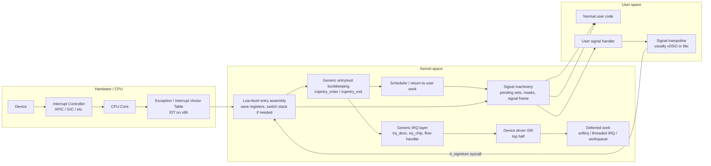

The key idea is that **Linux usually notices deliverable signals just before returning from kernel mode to user mode**, not at an arbitrary instruction in user code.

---

## 3. CPU privilege transition: user space to kernel space

When the CPU is executing user code and an interrupt, exception, or system call occurs, the CPU performs a hardware-defined control transfer into privileged mode.

### Generic sequence

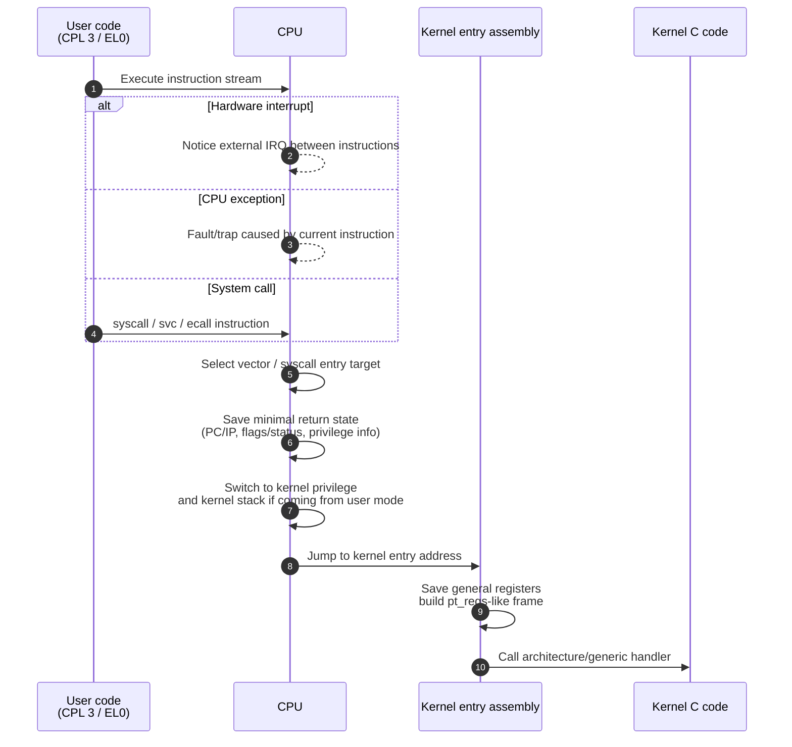

On x86-like systems, interrupt and exception dispatch uses an interrupt descriptor table. On syscall-capable x86-64, normal system calls usually enter through the `syscall` instruction rather than the old `int 0x80` software interrupt path.

---

## 4. Hardware interrupt path

A hardware interrupt is asynchronous with respect to the interrupted task. The interrupted task might be user code, kernel code, or the idle loop. The IRQ is not conceptually “sent to” that process; the process merely happened to be running on that CPU.

### Control-flow path

```mermaid
sequenceDiagram
    autonumber
    participant Dev as Device
    participant IC as Interrupt controller
    participant CPU as CPU core
    participant Entry as Kernel low-level IRQ entry
    participant Gen as Generic IRQ layer
    participant Chip as irq_chip<br/>controller ops
    participant ISR as Driver ISR<br/>top half
    participant Def as Deferred work
    participant Exit as Kernel IRQ exit
    participant Prev as Previous context<br/>user/kernel/idle

    Dev->>IC: Assert interrupt line / MSI
    IC->>CPU: Deliver vector to target CPU
    CPU->>Entry: Hardware control transfer to IRQ vector
    Entry->>Entry: Save interrupted registers/state
    Entry->>Gen: irqentry_enter(regs)
    Gen->>Gen: irq_enter_rcu()
    Gen->>Gen: invoke_irq_handler(regs, nr)
    Gen->>Gen: lookup irq_desc for IRQ number
    Gen->>Chip: ack/mask/EOI as required by flow type
    Gen->>ISR: action->handler(irq, dev_id)
    ISR-->>Def: queue softirq / threaded IRQ / workqueue if needed
    ISR-->>Gen: IRQ_HANDLED / IRQ_NONE
    Gen->>Chip: unmask or EOI as required
    Gen->>Exit: irq_exit_rcu()
    Exit-->>Def: maybe run pending softirqs
    Exit->>Entry: irqentry_exit(regs, state)
    Entry->>CPU: restore registers; interrupt return
    CPU->>Prev: resume previous context or enter scheduler/return-to-user work
```

### Layered view

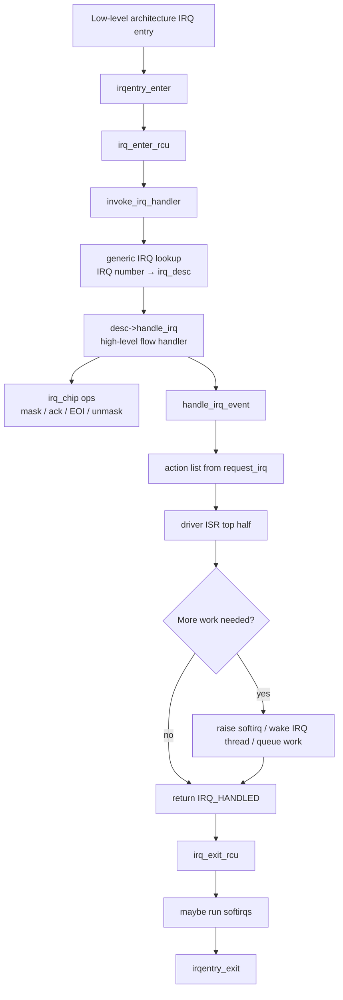

### Top half vs deferred work

| Mechanism | Runs in | Can sleep? | Typical use |
|---|---:|---:|---|
| Hard IRQ handler / ISR | Hard interrupt context | No | Acknowledge device, copy minimal state, schedule more work |
| Softirq | Bottom-half interrupt context | No | Networking RX/TX, timers, high-frequency deferred work |
| Threaded IRQ | Kernel thread context | Yes, with care | Drivers that need more expensive handling but still tied to IRQ |
| Workqueue | Kernel worker process context | Yes | General deferred work that may block |

The usual driver pattern is:

```text
IRQ arrives
  → hard IRQ handler does the minimum necessary work
  → schedules bottom half or thread
  → IRQ handler returns quickly
  → deferred context performs heavier work
```

---

## 5. CPU exception path

A CPU exception is synchronous: it is caused by the current instruction stream. Examples include page faults, divide errors, invalid instructions, breakpoints, and general protection faults.

### User-mode exception that becomes a signal

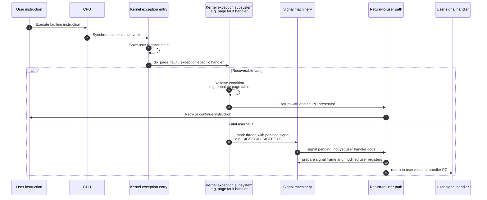

A page fault is not automatically a `SIGSEGV`. The kernel first tries to handle it. For example, it may load a demand-paged page from disk, grow a stack mapping, perform copy-on-write, or install a missing page-table entry. It becomes a signal only when the fault is invalid from the process’s point of view.

### Kernel-mode exception

If an exception occurs while the CPU is already executing kernel code, Linux cannot simply deliver a normal user-space signal unless the exception happened in a controlled region with a fixup path. Possible outcomes include:

- recover through an exception table fixup, common around safe user-memory access helpers;
- kill the current task if the kernel was acting on behalf of user space and recovery is possible;
- report an oops;
- panic if the fault is unrecoverable or policy requires it.

---

## 6. Signal generation vs signal delivery

Signal handling has two distinct phases:

1. **Generation**: a signal is created and marked pending for a process or thread.
2. **Delivery**: Linux decides to act on a pending unblocked signal, often when returning from kernel mode to user mode.

### Where signals come from

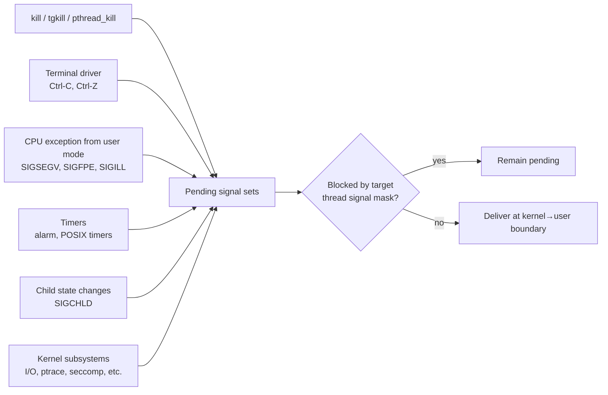

### Process-directed vs thread-directed signals

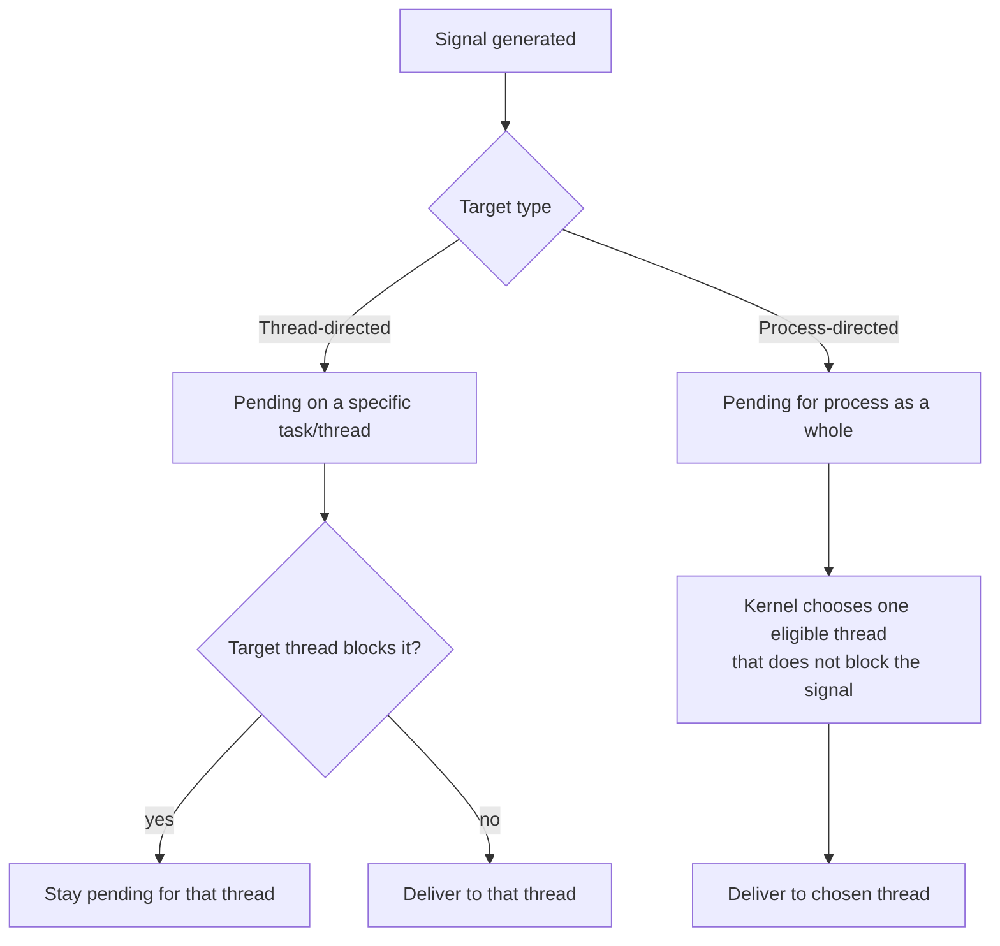

Each thread has its own signal mask. A process-directed signal can be delivered to any one thread that does not block it. A thread-directed signal must be delivered to that specific thread, once unblocked.

---

## 7. Signal delivery path: kernel returns to a user handler

A crucial point: **the kernel does not call your signal handler like a normal C function from kernel mode**. Instead, the kernel edits the saved user-mode context so that the next return to user mode starts at the signal handler.

### Delivery sequence

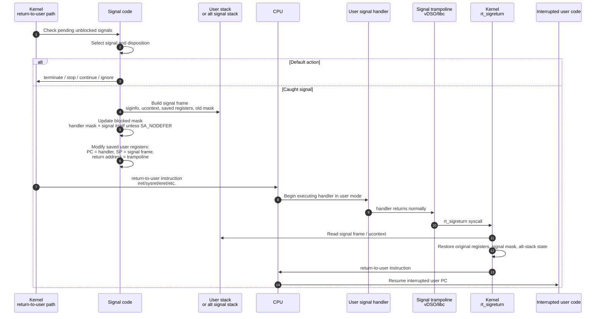

### Stack/register transformation

Before signal delivery:

```text
User registers saved in kernel pt_regs:
  RIP/PC = address in normal user code
  RSP/SP = normal user stack
  FLAGS  = normal user flags
  mask   = old blocked-signal mask
```

Kernel prepares delivery:

```text
User stack after kernel builds signal frame:

higher addresses
+-----------------------------+
| previous user stack content |
+-----------------------------+
| signal frame                |
| - siginfo_t                 |
| - ucontext_t                |
| - saved PC, SP, flags       |
| - saved signal mask         |
| - alt-stack state           |
+-----------------------------+  <- new user SP
lower addresses
```

Saved user registers are rewritten for the next user-mode return:

```text
PC/IP  := address of user signal handler
SP     := address of signal frame
RET    := address of signal trampoline
mask   := old mask + handler sa_mask + delivered signal, unless SA_NODEFER
```

Then the CPU returns to user mode, but it lands at the handler rather than at the original interrupted instruction.

---

## 8. Signal return path: `rt_sigreturn`

When a signal handler returns, it does not return directly to the interrupted instruction. It returns to a small user-space trampoline. The trampoline performs a special system call, usually `rt_sigreturn`, which gives control back to the kernel.

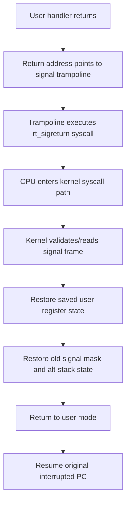

This is why the signal frame is security-sensitive: it contains the user context that the kernel will use to restore execution state. Modern kernels and C libraries cooperate to put trampoline code in vDSO or libc rather than executing code from a writable user stack.

---

## 9. Where signal delivery fits into interrupt/syscall/exception exit

Linux checks for pending work before going back to user space. That work can include signal delivery, rescheduling, tracing, ptrace, task work, and audit work.

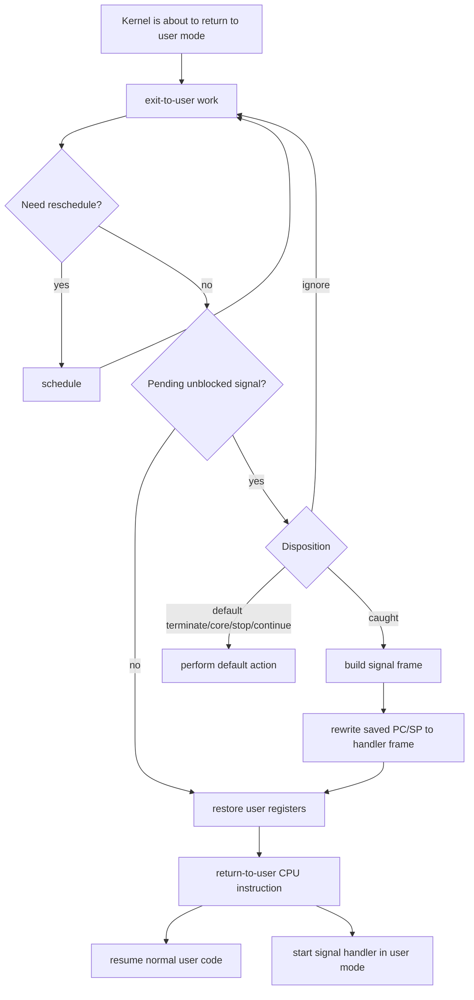

The same broad return-to-user boundary can be reached after:

- a system call;
- a hardware interrupt that interrupted user mode;
- a CPU exception from user mode;
- a context switch that schedules the task back onto a CPU.

---

## 10. System calls and signals

A system call is synchronous: user code intentionally enters the kernel. Signals may interact with blocking system calls.

```mermaid
sequenceDiagram
    autonumber
    participant U as User code
    participant CPU as CPU
    participant Sys as Kernel syscall path
    participant Wait as Blocking syscall<br/>read, poll, futex, etc.
    participant Sig as Signal delivery
    participant H as User handler

    U->>CPU: syscall instruction
    CPU->>Sys: enter kernel
    Sys->>Wait: syscall blocks
    Note over Wait: Task sleeps; scheduler runs something else
    Sig-->>Wait: Signal becomes pending and wakes task
    Wait->>Sys: syscall interrupted or restartable
    Sys->>Sig: return-to-user work checks signal
    Sig->>H: deliver handler by rewriting user context
    H-->>Sys: rt_sigreturn
    alt SA_RESTART and syscall is restartable
        Sys->>Wait: restart syscall or arrange restart
    else Not restartable
        Sys->>U: return -EINTR to user code
    end
```

`SA_RESTART` does not mean every interrupted system call is always restarted. It means Linux applies restart behavior for the set of syscalls where restart is supported.

---

## 11. End-to-end example: keyboard Ctrl-C to `SIGINT`

```mermaid
sequenceDiagram
    autonumber
    participant KB as Keyboard hardware
    participant IC as Interrupt controller
    participant CPU as CPU
    participant IRQ as Kernel IRQ handler
    participant TTY as TTY line discipline
    participant Sig as Signal subsystem
    participant Exit as Return-to-user path
    participant App as Foreground process
    participant H as SIGINT handler

    KB->>IC: Key event interrupt
    IC->>CPU: IRQ vector
    CPU->>IRQ: enter kernel IRQ path
    IRQ->>TTY: keyboard input processed
    TTY->>Sig: generate SIGINT for foreground process group
    Sig->>Sig: mark signal pending for target process/thread(s)
    IRQ->>Exit: finish interrupt; later return/schedule target task
    Exit->>Sig: check pending unblocked signal
    Sig->>App: if caught, arrange user handler frame
    App->>H: handler runs in user mode
```

The keyboard interrupt does not directly jump into the application’s `SIGINT` handler. The interrupt enters the kernel first; the terminal subsystem generates a signal; the signal is delivered later at a controlled kernel-to-user transition.

---

## 12. End-to-end example: invalid memory access to `SIGSEGV`

```mermaid
sequenceDiagram
    autonumber
    participant App as User code
    participant CPU as CPU/MMU
    participant PF as Page-fault entry
    participant VM as Linux memory manager
    participant Sig as Signal subsystem
    participant Exit as Return-to-user path
    participant H as SIGSEGV handler
    participant Tr as Trampoline
    participant Ret as rt_sigreturn

    App->>CPU: load/store invalid address
    CPU->>PF: page-fault exception
    PF->>VM: inspect VMA/page tables/access type
    alt valid recoverable fault
        VM->>VM: allocate/map page or resolve COW
        VM->>App: return; retry instruction
    else invalid access
        VM->>Sig: generate thread-directed SIGSEGV
        Sig->>Exit: pending signal for current thread
        Exit->>H: build frame; return to handler in user mode
        H->>Tr: handler returns
        Tr->>Ret: rt_sigreturn syscall
        Ret->>App: restore context; resume or continue as handler arranged
    end
```

If the handler returns without changing the faulting context, the process may re-execute the same invalid instruction and receive `SIGSEGV` again.

---

## 13. End-to-end example: network packet interrupt

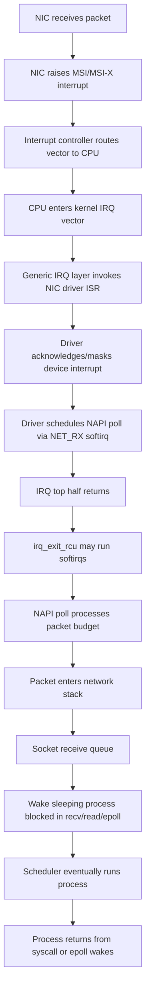

This example shows why interrupts are usually only the beginning of a longer kernel pipeline. The user process receives data through normal syscall/socket mechanisms, not through the hardware IRQ directly.

---

## 14. Important implementation structures

| Structure / concept | Location | Role |
|---|---:|---|
| `pt_regs` | Kernel stack / entry frame | Saved CPU register state used by exception/IRQ/syscall paths |
| `irq_desc` | Kernel generic IRQ layer | Describes one Linux IRQ number, including flow handler and chip data |
| `irq_chip` | Kernel IRQ controller abstraction | Provides mask, unmask, ack, EOI, affinity, and similar hardware operations |
| `irqaction` | Kernel IRQ layer | Represents handlers registered by `request_irq` / `request_threaded_irq` |
| `task_struct` | Kernel scheduler/task model | Per-thread state, including pending thread signals and blocked mask references |
| `signal_struct` / shared signal state | Kernel process-wide signal state | Process-directed signal state shared by a thread group |
| signal frame | User stack or alt signal stack | User-space frame containing saved context for handler and `rt_sigreturn` |
| vDSO / libc trampoline | User virtual address space | User-space code that invokes `rt_sigreturn` after handler returns |

---

## 15. Direction-of-control cheat sheet

### Hardware IRQ

```text
Device
  → interrupt controller
  → CPU vector dispatch
  → kernel low-level IRQ entry
  → generic IRQ layer
  → irq_chip flow control
  → driver ISR
  → deferred work, maybe
  → IRQ exit
  → previous kernel context OR return-to-user work
  → user code, if returning to user mode
```

### User CPU exception producing a signal

```text
User instruction faults
  → CPU exception vector
  → kernel exception entry
  → exception-specific kernel handler
  → maybe resolve fault
  → otherwise mark signal pending
  → return-to-user signal check
  → build user signal frame
  → modify saved user PC/SP
  → return to user handler
  → handler returns to trampoline
  → trampoline invokes rt_sigreturn syscall
  → kernel restores old context
  → return to original user PC
```

### Process sends signal with `kill(2)`

```text
Sender user code
  → syscall instruction
  → kernel sys_kill / sys_tgkill path
  → permission and target lookup
  → mark signal pending on process or thread
  → wake eligible target if sleeping
  → target later reaches kernel→user boundary
  → signal is delivered or default action is taken
```

---

## 16. Common misconceptions

### “The kernel calls my signal handler.”

Not as a kernel-to-user function call. The kernel builds a user-space stack frame and changes the saved user registers so that the CPU returns to user mode at the handler address.

### “A signal interrupts the process immediately.”

Usually no. The signal becomes pending. Delivery happens when the target thread is about to run in user mode and the signal is unblocked.

### “A hardware interrupt belongs to the currently running process.”

No. The interrupt belongs to a CPU and an IRQ line/vector. The current task is just the context that got interrupted.

### “A page fault means crash.”

No. Page faults are normal. Demand paging, stack growth, memory-mapped files, and copy-on-write all rely on page faults. A crash happens only if the fault cannot be resolved and the resulting signal takes a terminating default action.

### “Returning from a signal handler is a normal `ret` back to my old code.”

No. The handler returns to a trampoline, which performs `rt_sigreturn`. The kernel then restores the old user context from the signal frame.

---

## 17. Practical implications for C/C++ programmers

### Signal handlers run in user mode

A signal handler is ordinary user-space code with unusual entry/return mechanics. It is not kernel code and does not run with kernel privileges.

### Async signal safety matters

A signal handler may interrupt code while locks, allocators, or library internals are in inconsistent states. In portable POSIX-style code, do very little inside an asynchronous handler: set a `sig_atomic_t` flag, write to a pipe/eventfd when safe, or use `signalfd`/dedicated signal threads for structured designs.

### Multi-threaded programs need an intentional signal policy

A common design is:

```text
main thread at startup:
  block application-handled signals in all threads
  create a dedicated signal thread
signal thread:
  sigwaitinfo/signalfd loop
  convert signals into normal application events
worker threads:
  do not run arbitrary async signal handlers
```

This avoids random delivery of process-directed signals to arbitrary unblocked threads.

---

## 18. Minimal pseudocode models

### IRQ entry/exit pseudocode

```c
// Highly simplified; architecture-specific details omitted.
void interrupt_entry(struct pt_regs *regs, int vector)
{
    arch_interrupt_enter(regs);          // CPU/arch-specific state
    irqentry_state_t state = irqentry_enter(regs);

    irq_enter_rcu();                     // now in hardirq context
    invoke_irq_handler(regs, vector);    // generic IRQ + driver ISR
    irq_exit_rcu();                      // may process softirqs

    irqentry_exit(regs, state);          // may handle return-to-user work
    arch_interrupt_return(regs);         // restore state, return from interrupt
}
```

### Signal delivery pseudocode

```c
// Highly simplified conceptual model.
void exit_to_user_mode(struct pt_regs *regs)
{
    while (work_pending(current)) {
        if (need_resched())
            schedule();

        if (has_pending_unblocked_signal(current)) {
            struct ksignal ksig = dequeue_signal(current);

            if (ksig.default_action)
                perform_default_action(ksig);
            else if (ksig.ignored)
                continue;
            else
                setup_user_signal_frame(regs, &ksig); // edits user PC/SP
        }

        run_task_work_or_tracing_if_needed();
    }

    return_to_user_with_registers(regs);
}
```

### Signal handler return pseudocode

```c
// Conceptual user-space flow.
void user_signal_handler(int sig, siginfo_t *info, void *ucontext)
{
    // user handler body
    return;

    // actual return address points to trampoline, not old interrupted PC
}

void signal_trampoline(void)
{
    syscall(RT_SIGRETURN);   // kernel restores saved context from frame
}
```

---

## 19. One-page summary

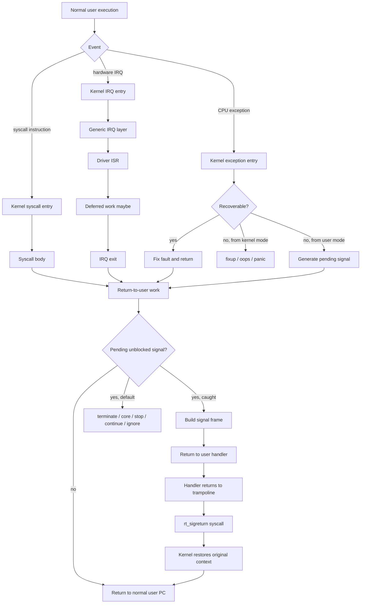

---

## References

- Linux kernel documentation, **Entry/exit handling for exceptions, interrupts, syscalls and KVM**: <https://docs.kernel.org/core-api/entry.html>
- Linux kernel documentation, **Linux generic IRQ handling**: <https://docs.kernel.org/core-api/genericirq.html>
- Linux man-pages, **signal(7)**: <https://man7.org/linux/man-pages/man7/signal.7.html>
- Linux man-pages, **sigaction(2)**: <https://man7.org/linux/man-pages/man2/sigaction.2.html>
- Linux man-pages, **sigreturn(2)**: <https://man7.org/linux/man-pages/man2/sigreturn.2.html>
- Linux man-pages, **vdso(7)**: <https://man7.org/linux/man-pages/man7/vdso.7.html>
